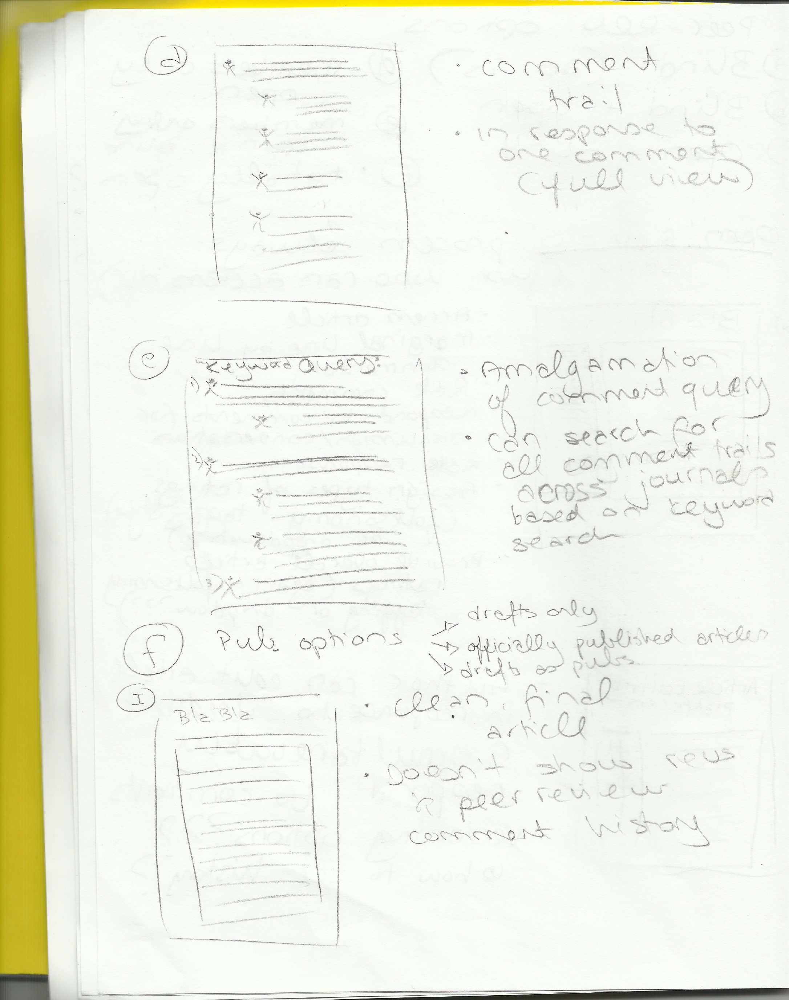

# Nina's Maker Lab Log (2013-14)

## Tuesday, 10 September 2013 (3:00-5:30pm)

Today I continued working through the Gaming the Edition Paper. I started making some minor changes, but still spent most of the day just adding comments with notes and thoughts (hope they're not too confusing and messy!). I'll work on actually incorporating those comments and revising the paper tomorrow.

## Monday, 9 September 2013 (9:30am-12:00pm; 12:30-2:30pm; 3:00-5:00pm)

This morning I met with Katie, Zaqir, and Shaun and walked through my wearables research with them. We talked about mechanisms to focus on with the Trouvé electronic jewels kit (i.e. they provide great early examples of how a battery works as well as how to create the electronic circuit to produce light); possible routes for different series of kits; the different components of the kit (written, visual, procedural, tacit, etc.) functioning together to make an argument and tell a story that brings out relevant scholarly and cultural topics; and the team began talking about how they want to start working on this project. I look forward to seeing the wearables kit take shape. I'd be more than happy to continue answering any questions the team might have or help in any other way.

I also started going through the Gaming the Edition Paper. I've made comments throughout and started looking at possible resources from the Social Knowledge Creation bibliographies that could address some of the textual studies and crowdsourcing feedback. Tomorrow I'll start making revisions to the document, and I'll contribute as much as I can to the Lit Review section.

Prior to Merritt's visit, as discussed, I'll contact her to check if she's ok with being recorded next week, and I'll let her know that I will pick her up from the hotel on Wednesday. Thanks for taking care of the announcement and asking Shaun to install Twine. Let me know if you think of anything else that needs to get done in preparation for her visit.
 

## Friday, 6 September 2013 (Kits)

In order to make it easier for the Kits team to take over the Flash Jewellery project, I've outlined a summary of my notes, thoughts, and approach on this project below. I'm meeting with the team on Monday to walk through this together.

General Kits background and approach I was working towards:

* Think of kits as enabling a material approach to history and culture through DIY physical computing and desktop fabrication - knowing by doing - tacit engagement with media and mechanisms of the past (<http://maker.uvic.ca/kitsposter/>)
* While researching, I tried to find instances of technologies that were not just historically and culturally relevant, but were also embedded in a unique and curious story. The goal was to find a historical device that would allow us to communicate a technology and a specific mechanism (e.g. sound transduction, battery-powered electronic light, etc.) more effectively in the form of a kit than in the form of an essay alone.
* I tried to balance cultural and historical significance with scholarly relevance, feasibility, usability, ease of replication, cost, etc.

Kits as Scholarly Arguments:

* Blog post series with Jentery (<http://maker.uvic.ca/kit1/>) - How is a kit persuasive compared with essays and monographs?
* Rhetoric for persuasion in a kit is different from essay: 1) more on the audience to assemble, assess, and think critically; 2) embedding the technology in a story brings together objects, subjects, and settings); 3) evidence in a variety of forms (audio, 3D models, images, schematics, etc.)
* The kits still apply oral/written rhetoric, but also use visual rhetoric, procedural rhetoric, tacit rhetoric - i.e. multimodal rhetoric
* By encouraging engagement with the materiality of an object, the kits can help to not only draw attention to the material particulars of a device or a technology, but also bring out the material dynamics of embodiments and perception - e.g. what can we learn from tacitly experiencing what kinds of devices performers wore in the late 1880s? What can we gather from the fact that this was then adopted as a fashion trend?
* Think of kits as prototyping history - historical experiments to engage with the technical particulars of a time/culture that is inaccessible now.

Wearables Kit:

* We wanted to find a wearables story that is more about the clothing article or fabric than wearables such as Google Glass, Steve Mann's work, or the concept of sousveillance. We wanted to find a unique story that dates back further than most people would expect for wearables.
* As I researched, I tried to find wearables that really made the technology an important part of the clothing object. For example:
	* Anouk Wipprecht creates wearables that function directly through the fabric - e.g. [Intimacy]((http://www.studioroosegaarde.net/project/intimacy/info/) is made out of opaque smart e-foils that become increasingly transparent the closer you are to other people, v2 also works in response to people's heartbeats. She does tons of cool stuff that uses technologies in unique ways (<http://www.fashioningtech.com/profiles/blogs/technosensual-review-interview-with-anouk-wipprecht>)
	* Lisa Stead's "[Emotional Wardrobe](http://we-make-money-not-art.com/archives/2005/11/lisa-stead-s-em.php#.UctgcZVH01Y)" uses sensors to change garment aesthetics based on wearer's emotional state; also makes articles of clothing that have their own emotions (e.g. Pikme the distressed and lonely scarf; Icaris the feather jacket troubled by low self-esteem and fear). PikMe is a scarf that craves the comfort of human touch and the warmth of a neck and uses three colours of electroluminescent wire woven within a tactile knit and a proximity sensor to activate a response. As described in Lee's book, ""Emotive colours intimate self-harm, and the EL wire is used to illuminate blue 'veins', turquoise 'bruises' and red 'gashes'" (174). 
* Another angle for the wearables kit that I haven't quite worked out but find interesting is to consider the work on the Analytical Engine created by Charles Babbage and Ada Lovelace (often termed the first computer) in the context of wearables. Apparently weaving functioned as an inspiration - this link would provide a really interesting angle to think of technology and wearables. As Sadie Plant shows in *Zeros and Ones*, the history of the computer is filled with gender issues and perceptions that could be interesting to incorporate in the development of a kit. (e.g. the work of Frances Geesin, who is a textile artist and an early pioneer of electro-textiles in the early/mid nineties when she realized that electroplating synthetic materials added conductivity to yarn.)
* Diana Dew's light-up clubbing fashion from the 1960s was a culturally relevant instance of wearables that led me to find Trouvé's Flash Jewellery. 
* Gustave Trouvé created kinetic or illuminated hat pins, brooches, diadems, etc. in the 1870s and 1880s (bijoux électriques). Initially they were used for costumes and performances, but they also became a fashion fad in England and France. The objects were powered by 2-4 golf hidden batteries operated by a switch carried in a pocket. 

* Trouvé's first patent was a dry-cell battery called "Lilliputian" (later become the AA we now know) - used this for electric jewellery - on Electric Light: Trouvé, Gustave. "Apparatus for Producing Electric Light."Journal of the Franklin Institute 105.1 (1878): 44-7. Print. [PDF here](http://uvic.summon.serialssolutions.com/link/0/eLvHCXMwVV1NC8IwDA2C4MXLQHv1D3SsXbq1Z1E8iYjCrv1IjwNx_x_TqaCnkFMCCe8FkkcAdjZrjD0PytY3gefRBinqrNlkZseEf9KxHzQ_VrCgcQP34-G2P8nPMwAZyyJfMjEqCsa7NijbUG7Jqxhj8oiGrOnaiB6T63wOSRFytJ7pqShUMNkukdrC2pej8XGaxWVJwDJzhUkU1BWcgYDV4PT1PLjL262-bv2cFVD1YxIM8nODSFWbFzNYOQs)
* Trouvé is interesting for the kits in general, because he patented 40 inventions in his life, ranging from flash jewellery and theatre props to an electrically motorized boat, medical devices, and installations. See Desmond, Kevin. "[Found ... in France: Kevin Desmond looks for records of a little-known French inventor who rivalled Thomas Edison.](http://go.galegroup.com.ezproxy.library.uvic.ca/ps/retrieve.do?sgHitCountType=None&sort=RELEVANCE&inPS=true&prodId=CPI&userGroupName=uvictoria&tabID=T002&searchId=R1&resultListType=RESULT_LIST&contentSegment=&searchType=AdvancedSearchForm&currentPosition=1&contentSet=GALE%7CA171139399&&docId=GALE|A171139399&docType=GALE&role=)"History Today 57.11 (2007): 5+. Canadian Periodicals Index Quarterly. Web. 4 Sept. 2013. And: <http://www.classicboat.co.uk/articles/gustave-trouve-memoirs-of-a-motorboating-man/>

* From the work I've done this summer, we imagine this kit containing, for example: 
	* an original essay on gender dynamics, fashion, and early electricity
	* aspects of 19th-century print and visual culture (e.g., historical images)
	* 3D models (e.g., OBJ files and ABS prints) of jewellery pieces
	* component electronic parts necessary to produce expressions with light

Other considerations:

* Interesting DIY wearables resources:
	* Syuzi Pakhchyan's [Fashioning Technology: A Diy Intro to Smart Crafting](http://www.worldcat.org/title/fashioning-technology-a-diy-intro-to-smart-crafting/oclc/190777229&referer=brief_results#.UdyI9_ukPl0.email)
	* Diana Eng has created a DYI fashion wearables book called Fashion Geek: Clothes Accessories Tech that might be interesting. Here's an example of a project from that book: <http://iheartswitch.com/blog/diy-led-necklace-diana-eng>.
	* Leah Buechley also focuses on wearable DYI projects. For example this [DYI tank with LED lights in it](http://web.media.mit.edu/~leah/grad_work/diy/diy_tank.html).
* Interesting perspective in [Fashionable Technology](http://www.fashionabletechnology.org): Seymour sees clothes as an interface to the environment that functions as a transmitter and receiver of emotions, experiences, and meaning, and she's interested in the way technology can increase the expressive potential of clothes (12). Thus fashionable wearables can have functional, material, cultural, social, and political functions. 
* Helpful wearables resources in the ["Back Matter"](http://link.springer.com.ezproxy.library.uvic.ca/book/10.1007/978-3-211-74500-7/page/1) section of Fashionable Technology

## Wednesday, 28 August 2013 (INKE)

Below is my current draft for the INKE NY paper. It's longer than we had discussed, so as you provide your feedback, please also let me know if there are sections that you think should be cut or tightened up. 

I'm arriving in Victoria on Thursday evening. If you're free on Friday or Tuesday, I'd be happy to meet to discuss the paper. Or we can just correspond via GitHub and email. Whatever works best for you.

### Jentery's Feedback on the INKE Draft (log for 28 August) 

I've edited the paper below, Nina. If you don't mind, then I'm going to submit it today. I think it's well beyond ready! Fantastic work here! Thank you.  

### Prototyping Personas for Open, Networked Peer Review

Nina Belojevic (UVic), Jentery Sayers (UVic), and the INKE Research Team

Paper for “Research Foundations for Understanding Books and Reading in the Digital Age: E/Merging Reading, Writing, and Research Practices” | 26-27 September 2013 | New York University, New York

As this year’s INKE gathering indicates, networked, social knowledge creation is an increasingly relevant scholarly practice, with the potential for new tools and techniques to spark novel forms of composition, publication, and research dissemination. Amidst social knowledge trends, scholars now routinely call for the reform of scholarly communication practices, often with an interest in translating existing social knowledge mechanisms (e.g., Twitter and Disqus) into dynamic forms of scholarly review and community-building. In response to these calls, our group of INKE researchers has---through a blend of game studies, platform studies, and interaction design methods---prototyped a plugin to extend the affordances of academic publication platforms (e.g., Open Journal Systems) for open, networked peer review. To this end, the prototype enacts strategies to transform individuated peer feedback into peer-to-peer networks for collective, scholarly review. Leveraging insights from models such as Stack Overflow, CommentPress, and Digress.it, our prototype offers a model for the reform of scholarly communication and review in a way that acknowledges the many, often divergent roles scholars play on a daily basis.

In ["Beyond Metrics: Community Authorization and Open Peer Review"](http://dhdebates.gc.cuny.edu/debates/text/7), Kathleen Fitzpatrick draws attention to the realities of the “academy’s system of accounting,” in which work that has not been peer reviewed has no value, while also pointing out the benefits of the discussions generated by blogs (n. pag.). Recognizing the mismatch between “conventional peer review” and the “structures of intellectual engagement on the Internet” (n. pag.), Fitzpatrick has participated in the development of environments (such as CommentPress and MediaCommons) that offer community-based reputation and recommendations in addition to, or in place of, publisher-derived selections. Fitzpatrick effectively describes the strengths of such systems when she explains that “crowdsourced review can improve on traditional review practices not just by adding more readers but by placing those readers into conversation with one another and with the author, deepening the relationship between the text and its audience” (n. pag.). 

Taking into consideration Fitzpatrick’s insights regarding peer-to-peer review, reputation systems, and scholarly conversation, our prototype operates within existing (cyber)infrastructures and peer review protocols, while adding new layers of engagement. Thus our prototype can be embedded into established metrics and systems of blind peer review, without abandoning scholars’ well-established investments in either of them. Here, we not only construct the “openness” of open peer review on a spectrum (e.g., through degrees or levels of access). We also stress the important roles that both incentive and history play in the prototype, arguing for “peer review personas” that help scholars: 1) provide a diverse range of commentary on scholarly communications, 2) document and aggregate granular activity over time and across venues, 3) develop reputations in their domains of expertise as well as authority in their communities of practice, 4) perform the context-dependent identities that professional peer review demands, 5) collaborate (knowingly or not) with a collective of allied practitioners, and 6) assess the tendencies and biases of peer review in the aggregate. These attributes can be recognized again in the description of the individual wireframes, which are provided below.  

In order to achieve a coherent environment that can house such a multitude of activities, forms of participation, and aggregate data, as well as individual representations of contributions, we applied a game-inspired approach that implicitly informs the rules of participation and mechanics of engagement. The potency of game-inspired approaches has been emphasized by the recent announcement of the Clinton Global Initiative Commitment to Action that states a commitment to expand "Open Badges" in an effort to facilitate an alternative credential system (“President Clinton Announces Commitment” n. pag.). While they certainly have their flaws, game-based approaches may provide a method to respond to current challenges, shifts, and frameworks within scholarly communication communities. Especially in the networked, social sphere of the web, many proven, game-related practices (e.g., the gameplay of Foursquare) can be used as models. However, rather than relying solely on well-known game elements taken out of game contexts (a practice otherwise known as gamification), our prototype was developed through a process more deeply seeded in a game design ethos. For instance, the game-design model that we used to develop our prototype relies heavily on Katie Salen and Eric Zimmerman’s excellent work in *Rules of Play*, particularly their description of meaningful play achieved through the core game mechanics that define interaction between players and systems (or operators and machines). Our goal was to model an environment that encourages meaningful play (even if only implicitly) in non-game contexts within the humanities. Our prototype shows how it might be possible to incite key user interactions through core game mechanics in order to effectively bring discernible and integrated meaning to the users'/players' interactions with the system. To that effect, key interactions, such as commenting, discussion, and voting, are made relevant as core mechanics not simply in the form of badges, but by offering a layer of identification in the form of personas and communities. Here, the emphasis is on the social relations at work in peer review and scholarly communication, relations that are always mediated, whatever the technological conditions may be.  

While maintaining existing features and blind peer review processes, the prototype shows how an open peer review layer could be added for journals who choose to offer such an option (across the entire journal, for specific issues, or in particular sections).  

The gameful design approach helps to bring discernible and integrated meaning to the users' interactions (such as reviewing articles, inserting margin comments, and engaging in discussion with the author and other reviewers) with the system. The core mechanics of the system consist of the following forms of engagement:

* Persona Tagging: While each user has one profile, they can have multiple personas. Personas are intended to indicate the many types of roles and skills scholars apply on a daily level, ranging from topical expertise (e.g., on Victorian poetry) to proofreading to JavaScript knowledge. Personas consist of keyword tags. Some of these persona tags may be created as standards or controlled vocabularies in the system, but new ones can be created by users in a folksonomy style. Each persona tag that gets attached to a user can then also receive votes by other users.
 
* Article and Comment Votes: The open peer review process occurs on two main levels: 1) a review form responding to the overall article that can be viewed by all users in the community, and 2) margin comments that get voted up or down by the community and should encourage discussion both among reviewers and with the author.

* Community Formation: Users and journals can create communities around specific topics or disciplines. Communities can be open to anyone or members-based. This format aims to encourage collaboration, especially by bringing experts together in a place that allows review and discussion of their work while visualizing activities and making content easily searchable. 

While these forms of engagement do not form an immersive game, the mechanics of engagement and the definition of areas for identification, such as personas, profiles, and communities, allow users to recognize how otherwise separate activities function together, relationally.  

Such an infrastructure enables a simple interface for interaction while allowing for levels of complexity that can address a number of concerns that scholars have raised in discussions regarding social scholarly environments. One relevant area of discussion has been the distinction between contributions, achievements, reputation, and credentials. In the vexed discourse around the “Badges for Lifelong Learning” competition, Cathy Davidson has noted that the badge system offers a way to provide credit for achievements and contributions, rather than reputation and credentials (“Why Badges,” n. pag.). The “Badges for Lifelong Learning” competition has led to much valuable discussion at HASTAC.org, including a post and corresponding comments on the distinction between reputation and credentialing systems. As Sheryl Grant states, a reputation system collects and aggregates crowdsourced feedback, while credentials are vetted by a recognized authority “that defines some measure of competence or quality” (“What Reputation Systems Can Teach Us,” n. pag.). By applying the fluidity of a voting system, our model shows how contributions and achievements can not only be acknowledged in the form of badges, but reputation can be built on a sliding scale. Whether certain levels of reputation eventually achieve the standard of a credential depends on the level of authority that is associated with the system. The various activities---from achieving the journal’s acceptance of an article to submitting a margin comment to publishing a blind peer-reviewed article---can be seen as contributions and forms of achievements. Additionally, votes help to build a reputation for a person’s profile, persona, or an entire community. Implicitly, high votes may also, in turn, be regarded as a form of credentials. Furthermore, the fluid nature of a voting system (rather than a rating system within a given range) also addresses concerns regarding standards without standardization, as described by Ian Bogost in response to Davidson’s HASTAC post on badges (“Why Badges,” comments section). With an understandably skeptical view of badge systems, Bogost points out that quality of a contribution “only becomes meaningful when standardized.” While this is true, the voting mechanism presented in our prototype operates in a more fluid, even infinite, realm. Following the partially successful model of Stack Overflow, a voting mechanism provides a community-driven form of defining the quality of a contribution without being restricted by a predefined scale (such as a five-star scale, ABCD grading system, etc.). Yet, at the same time, community members must remain self-reflexive about theses voting mechanisms, including the ways in which opaque technologies can encourage and even enable biases (e.g., related to gender, race, sexuality, and perceived degrees of expertise) in practices like peer review. Through its emphasis on contingent social relations and personas that are performed (rather than fixed), our prototype aims to foster such self-reflexivity, acknowledging all the while that it is no small task.    
	
Additionally, the mechanics of digital interaction and the social, community-based environment allow for access to metrics that range across a wide scale, from an individual rating of a comment to the collective activity of a community consisting of numerous users and journals. In “Beyond Metrics,” Fitzpatrick raises the importance of metrics to communicate the work and achievements taking place in such digital environments and to offer forms of assessment for academic committees, institutions, and organizations. Importantly, she notes that the profit-driven, marketing-devised benchmark of conversions (e.g., the conversion from visitor to customer through a sale in profit-driven industries) may not be especially relevant in scholarly environments. Instead, a measurement to indicate engagement (a metric that many brand advertisers and public relations practitioners use) would offer more insights in academic domains. However, engagement---similar to conversions ---must be uniquely defined and formulated by each organization. Just as a bank might not define a conversion in the same way as a shoe store, so an academic journal may not define engagement in the same way as Facebook. While the range of data available in such a digital environment, ranging from the general to the particular, would be incredibly useful and insightful in itself, a formula for a metric such as engagement would offer new insights while also raising various issues along with it. A common formula for engagement would take the sum of all interactions that are considered relevant and divide those by all users in the equivalent timeframe. However, this raises the question what interactions are relevant in a scholarly context and how those interactions are mediated in the first place. Additionally, the issue of quality emerges. For instance, would a comment that has generated no further engagement and received zero or even negative votes "count" as much as a comment that has received numerous positive votes and sparked a long, insightful discussion thread? Even if this risk could be addressed to a certain extent by considering the average vote when calculating the sum of interactions for the engagement formula, one would always risk the reductionist possibility that occurs in the numerical representation of scholarship, a representation against which Fitzpatrick adamantly warns. Nevertheless, the metrics made available through our model would offer new insights into the tensions between scholarly expression in the humanities and readily changing attention economies (not to mention concomitant modes of data visualization). For example, users’ interactions could not only be seen on the individual or "ground" level. Aggregate views of granular activity would also afford a way to assess (often unacknowledged) practices, tendencies, and biases that take place in the peer review process. In other words, we are proposing a scaleable approach to networked peer review, across close and distant readings, in order to encourage flexible metrics and frameworks. 

In addition to the new data metrics that this open, networked peer review model offers, our prototype adds a new layer to the publication of journal articles. This layer could be offered in addition to, or in place of, the current model of accepted, blind peer-reviewed articles that get published in a given issue---a decision that each journal publisher or organization could make separately. As also noted by Fitzpatrick in “Beyond Metrics,” to a certain extent such an approach parallels Clay Shirky’s “publish, then filter” model. While an article would still need to be accepted for open peer review, more articles would enter such a stage than in the traditional system, thus allowing the community of readers to vote, give feedback, and engage in conversation about the article. Such activity would shape or at least influence the reputation of the article and the author. Furthermore, the reputation of the voters and commenters may also influence how other readers view the article (i.e., if a highly recognized scholar with a strong reputation gives an article a high vote, this might give that vote more weight in the view of the reader). In addition to the common Internet models that Shirky mentions, our prototype is not only reader-centric but also offers value to the contributors by shaping an environment for them to build their profile and persona reputation. The model we propose provides a structure whereby articles can move through at least three stages: 

* Accepted: Articles that have been accepted by a journal and can be viewed by a community on a publication platform. These articles are accessible for open peer review. They could be discoverable by Internet search engines, behind a passcode-protected wall, or somewhere in between (e.g., not discoverable by engines but also not passcode-protected).  

* Open Review: Articles that have gone through the open peer review process shown in our prototype, but have not gone through blind peer review. Authors (and journals) may choose to only go through this stage and not continue with the blind review process. Alternatively, they could skip this stage and go directly to blind review, or they could engage blind review first.   

* Blind Review: Articles that have gone through the blind peer review process and get published as such. Again, blind review could follow open review, precede it, or not involve open review at all. Authors and journals could make these decisions on a case-by-case basis, if they so desired.  

Based on this structure, the open peer review process can function as a plugin to use in addition to existing review formats in, for example, OJS. As indicated in the overview map, the different areas of interaction (profile/persona, article specific, community level, and journal specific) are all interconnected. Users engage with articles and in communities, while the articles remain journal-specific.  Furthermore, users as well as journals create the communities (e.g., a community anchored in Victorian poetry), and journal-specific articles authored and reviewed by users can be found within communities. The six wireframes we have developed communicate the functionalities within these areas of interaction in more detail.

1) The main article view shows an accepted article and the margin space where open peer reviewers can make comments, vote on each other's comments, and engage in discussion. Readers can also review the article as a whole by clicking on the "Review Article" link. Margin comments can be made on a line-specific level and allow for a completely free range of commentary, thus allowing users to perform context-dependent identities. In addition to indicating the journal to which a particular article belongs, this page also shows to which community it belongs, the topics of interest to that community (e.g. through a keyword cloud), and what other communities might interest the reader. The article page as well as the community pages encourage conversation and collaboration between users. Importantly, the main article page also provides a space for the author to engage in open conversation with the reviewers, at least in cases where the review is not blind.  

2) The "Review Article" link on the main, accepted article page opens a pop-up window for readers to review and vote on aspects of the overall article. The categories on which to vote and comment can mirror current blind peer review forms, but should also include the option for reviewers to create new persona tags on which to comment and vote. Such persona tags can be a way to formalize any form of contribution, from writing style, to technical expertise, to topical expertise, thus allowing scholars to develop reputations in areas that may often go unnoticed in traditional academic environments.

3) Readers vote on margin comments using another pop-up form. This form contains selections of existing persona tags in dropdowns, and the reader can create new persona tags and vote. All margin commentary would be displayed in order of the votes (following a model similar to Stack Overflow). Again, the folksonomic approach of persona tagging allows scholars to build reputations for contributions that may not be otherwise acknowledged.

4) The profile main page shows the user's overall contributions, votes, and discussion generation, while also indicating persona tags and activity (i.e., comparing persona-specific votes). In addition to the persona tags, a keyword cloud provides further insights into the research or professional areas that interest a particular user. From this page, people can access that particular user's individual persona pages.

5) The persona-specific page indicates average votes over time as well as discussion generation, keywords, and recent activity specific to that persona. Ideally, this approach to peer review foregrounds a user's strengths or patterns in a specific authoring, review, and publication environment. As noted above, personas are partially defined by other users, so a person could have any number of personas and build a persona-specific reputation through the votes and feedback given by other users.

6) The community main page indicates average votes on articles, members, and comments within that community. Keywords and links to similar communities display the areas of interest within the community. A discussion feed lists recent peer review commentary. A persona breakdown graph shows what kinds of personas participate in the community (thus also highlighting who does not participate, or who might be missing from a given conversation). Popular articles and members would also be listed. Finally, a graph would visualize engagement over time, based on article votes, comments, comment votes, and discussion generation.

As shown in the wireframes, our prototype provides a working model for a plugin that could be added to a platform such as OJS in order to offer a new, networked, and open layer to the peer review process. Such a model not only affords open review, the review of reviews, and conversations on the margins. It also acknowledges scholarly activities at multiple levels of participation, with degrees of granularity. Furthermore, it moves beyond a single-layered credential or badge system, and instead combines contribution, achievements, reputation, and potentially even credentials. Additionally, the prototype underscores some opportunities that exist to gain insights (through data and networking mechanisms) about modes of collaboration, revision processes, and biases in peer review processes. However, such new forms of participation and access inevitably raise new concerns. That said, at this stage of our project, we would like to engage digital humanities practitioners (in general) and the INKE research community (in particular) in order to better address concerns and perspectives that might inform and enrich our model for networked, open peer review.

###Works Cited

Arbuckle, Alyssa, et al. “A Select Annotated Bibliography Concerning Social Knowledge Creation and Conveyance.” Forthcoming.

Arbuckle, Alyssa, et al. “A Select Annotated Bibliography Concerning Social Knowledge Creation Tools.” Forthcoming.

Belojevic, Nina, et al. “A Select Annotated Bibliography Concerning Game-Design Models for Digital Social Knowledge Creation.” Forthcoming.

Cohen, Daniel J. “The Social Contract of Scholarly Publishing.” *Debates in the Digital Humanities*. Ed. Matthew K. Gold. Minneapolis: U of Minnesota P., 2012. Web. 28 Aug. 2013.  

Davidson, Cathy N. “The Futures of Scholarly Publishing—Urgently and Again.” HASTAC. 12 Aug. 2009. Web. 18 Oct. 2012.

---. “Why Badges? Why Not?” HASTAC. 16 Sept. 2011. Web. 18 Oct. 2012.

Davidson, Cathy N., and David Theo Goldberg. “Engaging The Humanities.” *Profession* (2004): 42-62. MLA International Bibliography. Web. 13 Dec. 2012.

Digital Media and Learning Competition. “President Clinton Announces Commitment to Create New Pathways to College and Career Success Through Open Badges.” HASTAC. 13 Jun. 2013. Web. 25 Aug. 2013.

Fitzpatrick, Kathleen. “Beyond Metrics: Community Authorization and Open Peer Review.” *Debates in the Digital Humanities*. Ed. Matthew K. Gold. Minneapolis: U of Minnesota Press, 2012. Web. 28 Aug. 2013.

---. “CommentPress: New (Social) Structures for New (Networked) Texts.” *Journal of Electronic Publishing* 10.3 (2007): n. pag. Web. 1 Feb. 2013.

---. “Peer-to-Peer Review and the Future of Scholarly Authority.” *Cinema Journal* 48.2 (2009): 124-29. Print.

---. *Planned Obsolescence: Publishing, Technology, and the Future of the Academy*. New York: New York UP, 2011. Print.

Grant, Sheryl. “What Reputation Systems Can Teach Us About Badge System Design.” HASTAC. 14 Jul. 2013. Web. 25 Aug. 2013.

Jones, Steven E. “Performing The Social Text: Or, What I Learned From Playing Spore.” *Common Knowledge* 17.2 (2011): 283-91. Web. 14 Dec. 2012.

Salen, Katie, and Eric Zimmerman. *Rules of Play: Game Design Fundamentals*. Cambridge, MA: MIT, 2003. Print.

Shirky, Clay. *Here Comes Everybody: The Power of Organizing Without Organizations*. New York: Penguin Press, 2008. Print.

Siemens, Ray, with Alex Garnett, Corina Koolen, Cara Leitch, Meagan Timney, and the ETCL, INKE, and PKP Research Groups. “Toward Modeling the Social Edition: An Approach to Understanding the Electronic Scholarly Edition in the Context of New and Emerging Social Media.” *Literary and Linguistic Computing* 27.4 (2012): 445-61. Web. 1 Feb. 2013.

## Wednesday, 31 July 2013 (INKE)

I just tweaked the wording on the wireframe showing the article review form, as per our conversation on Monday. If there is anything else you would like me to change or have feedback on, please let me know. In regard to developing this into something that can be submitted to Connie by August 29th, would you have time to briefly chat about that on Tuesday (maybe after Jon and I demo our consoles) or on Wednesday? Also, I was wondering if we should share the work completed so far with Ray to show him what we have developed over the last month?

### Persona- and Community-Based Peer Review Prototype

Researchers from the INKE M&P team have developed a wireframe prototype for a new peer review process that can function as a plugin for the Public Knowledge Project's Open Journal Systems platform. While maintaining existing features and blind peer review processes, the prototype shows how an open peer review layer could be added for journals who choose to offer such an option.

The prototype has been developed with a gameful design approach. While not intended as an actual game with a narrative, game-inspired elements have been included, applying notions of core game mechanics in order to incite key user interactions, thus bringing discernible and integrated meaning to the users' interactions with the system (such as reviewing articles, inserting marginal comments, and engaging in discussion with the author and other reviewers).  Of particular note are the following features:

* Persona Tagging: While each user has one profile, they can have multiple Personas. Personas are intended to indicate the many types of roles and skills scholars apply on a daily level, ranging from topical expertise (e.g. on Victorian poetry) to proofreading to JavaScript knowledge. Personas consist of keyword tags. Some of these Persona Tags may be created as standards in the system, but new ones can be created by users in a folksonomy style. Each Persona Tag that gets attached to a user can then also receive votes by other users.
 
* Article and Comment Votes: The open peer review process occurs on two main levels: 1) a review form responding to the overall article -- this can be viewed by all users in the community; 2) marginal comments that get voted up or down by the community and should encourage discussion among reviewers and with the author.

* Community Formation: Users and journals can create communities around specific topics or disciplines. Communities can be open to anyone or members based. This format aims to encourage collaboration, especially by bringing experts together in a place that allows review and discussion of their work while visualizing activities and making content easily searchable. 

In addition to these three key features, articles in journals that participate in this new peer review process can go through three stages: 

* Accepted: Articles that have been accepted by a journal and can be viewed in the OJS platform and in a community. These articles are accessible for open peer review.

* Open Review: Articles that have gone through the open peer review process shown in our prototype, but have not gone through blind peer review. Authors (and journals) may choose to only go through this stage, but not continue with the blind review process.

* Blind Review: Articles that have gone through the blind peer review process and get published in the final edition of a specific journal.

Based on this structure, the open peer review process can function as a plugin to use in addition to existing review formats in OJS. As indicated in the overview map, the different areas of interaction (profile/persona, article specific, community level, and journal specific) are all interconnected. Users engage with articles and in communities, while the articles remain journal specific. Furthermore, users as well as journals make up the communities, and journal specific articles authored and reviewed by users can be found within communities. The six wireframes we have developed communicate the functionalities within these areas of interaction in more detail.

1) The main article view shows an accepted article and the marginal space where open peer reviewers can make comments, vote on each other's comments, and engage in discussion. Readers can also review the article as a whole by clicking on the "Review Article" link. In addition to indicating the journal that the particular article belongs to, this page also shows which community it belongs to, what topics that community focuses on (e.g. through a keyword cloud), and what other similar communities might be interesting for the reader. 

2) The "Review Article" link on the main accepted article page opens a pop-up window for readers to review and vote on aspects of the overall article. The categories to vote and comment on can mirror the current blind peer review forms (<http://pkp.sfu.ca/ojs/docs/userguide/2.3.3/journalManagementReviewForms.html>), but may also include the option for reviewers to create new "Persona Tags" to comment and vote on.

3) Readers  vote on marginal comments using another pop-up form. This contains selections of existing persona tags in dropdowns, and the reader can create new persona tags and provide a vote. All marginal commentary would be displayed in order of the votes (following a model similar to that of StackOverflow).

4) The profile main page shows the user's overall contributions, votes, and discussion generation, while also indicating persona tags and activity (i.e. comparing persona-specific votes). In addition to the persona tags, a keyword cloud provides further insights into the areas of interest of that particular user. From this page, the individual persona pages from that user can be accessed.

5) The persona specific page indicates average votes over time as well as discussion generation, keywords, and recent activity specific to that persona. This provides a way to bring out a user's strengths and activities in the OJS environment.

)

6) The community main page indicates average votes on articles, members, and comments within that community. Keywords and links to similar communities display the areas of interest within the community. A discussion feed lists recent peer review commentary. A persona breakdown pie chart shows what kinds of personas participate in the community. Top articles and members would also be listed. Finally, a graph could visualize engagement over time, based on article votes, comments, comment votes, and discussion generation, thus combining amount of interaction and the votes with which the user base esteems the content of the community.

## Sunday, 28 July 2013 and Monday 29 July 2013 (INKE)

Yesterday and today I continued working on the open peer review wireframes and the overview map. Below I have included a brief writeup as well as images of all the assets I have developed so far:

### Persona- and Community-Based Peer Review Prototype

Researchers from the INKE M&P team have developed a wireframe prototype for a new peer review process that can function as a plugin for the Public Knowledge Project's Open Journal Systems platform. While maintaining existing features and blind peer review processes, the prototype shows how an open peer review layer could be added for journals who choose to offer such an option.

The prototype has been developed with a gameful design approach. While not intended as an actual game with a narrative, game-inspired elements have been included, applying notions of core game mechanics in order to incite key user interactions, thus bringing discernible and integrated meaning to the users' interactions with the system (such as reviewing articles, inserting marginal comments, and engaging in discussion with the author and other reviewers).  Of particular note are the following features:

* Persona Tagging: While each user has one profile, they can have multiple Personas. Personas are intended to indicate the many types of roles and skills scholars apply on a daily level, ranging from topical expertise (e.g. on Victorian poetry) to proofreading to JavaScript knowledge. Personas consist of keyword tags. Some of these Persona Tags may be created as standards in the system, but new ones can be created by users in a folksonomy style. Each Persona Tag that gets attached to a user can then also receive votes by other users.
 
* Article and Comment Votes: The open peer review process occurs on two main levels: 1) a review form responding to the overall article -- this can be viewed by all users in the community; 2) marginal comments that get voted up or down by the community and should encourage discussion among reviewers and with the author.

* Community Formation: Users and journals can create communities around specific topics or disciplines. Communities can be open to anyone or members based. This format aims to encourage collaboration, especially by bringing experts together in a place that allows review and discussion of their work while visualizing activities and making content easily searchable. 

In addition to these three key features, articles in journals that participate in this new peer review process can go through three stages: 

* Accepted: Articles that have been accepted by a journal and can be viewed in the OJS platform and in a community. These articles are accessible for open peer review.

* Open Review: Articles that have gone through the open peer review process shown in our prototype, but have not gone through blind peer review. Authors (and journals) may choose to only go through this stage, but not continue with the blind review process.

* Blind Review: Articles that have gone through the blind peer review process and get published in the final edition of a specific journal.

Based on this structure, the open peer review process can function as a plugin to use in addition to existing review formats in OJS. As indicated in the overview map, the different areas of interaction (profile/persona, article specific, community level, and journal specific) are all interconnected. Users engage with articles and in communities, while the articles remain journal specific. Furthermore, users as well as journals make up the communities, and journal specific articles authored and reviewed by users can be found within communities. The six wireframes we have developed communicate the functionalities within these areas of interaction in more detail.

1) The main article view shows an accepted article and the marginal space where open peer reviewers can make comments, vote on each other's comments, and engage in discussion. Readers can also review the article as a whole by clicking on the "Review Article" link. In addition to indicating the journal that the particular article belongs to, this page also shows which community it belongs to, what topics that community focuses on (e.g. through a keyword cloud), and what other similar communities might be interesting for the reader. 

2) The "Review Article" link on the main accepted article page opens a pop-up window for readers to review and vote on aspects of the overall article. The categories to vote and comment on can mirror the current blind peer review forms (<http://pkp.sfu.ca/ojs/docs/userguide/2.3.3/journalManagementReviewForms.html>), but may also include the option for reviewers to create new "Persona Tags" to comment and vote on.

3) Readers  vote on marginal comments using another pop-up form. This contains selections of existing persona tags in dropdowns, and the reader can create new persona tags and provide a vote. All marginal commentary would be displayed in order of the votes (following a model similar to that of StackOverflow).

4) The profile main page shows the user's overall contributions, votes, and discussion generation, while also indicating persona tags and activity (i.e. comparing persona-specific votes). In addition to the persona tags, a keyword cloud provides further insights into the areas of interest of that particular user. From this page, the individual persona pages from that user can be accessed.

5) The persona specific page indicates average votes over time as well as discussion generation, keywords, and recent activity specific to that persona. This provides a way to bring out a user's strengths and activities in the OJS environment.

)

6) The community main page indicates average votes on articles, members, and comments within that community. Keywords and links to similar communities display the areas of interest within the community. A discussion feed lists recent peer review commentary. A persona breakdown pie chart shows what kinds of personas participate in the community. Top articles and members would also be listed. Finally, a graph could visualize engagement over time, based on article votes, comments, comment votes, and discussion generation, thus combining amount of interaction and the votes with which the user base esteems the content of the community.

### Jentery's Feedback on 28 and 29 July Logs

This is really fantastic work, Nina. Thanks so much! As we proceed, we'll just need to think about how to translate what's in your log into something for the NYU paper. Make sense? Honestly, I think you've already done a bulk of the work! It's really smart stuff. I'm sure you'll wow them in NY. See you next week. 

## Thursday, 25 July 2013 (3:30-5:30pm and INKE 9:30-10:30pm)

Today I continued working on the open peer review prototype wireframes and map, and I helped organize the MLab library. I'm still working on the map, but once that's ready I'll post the revised wireframes and the map in my log.

## Wednesday, 24 July 2013 (INKE 2:30-5:00pm)

I continued working through the wireframes. I created a new Persona one and made small adjustments to the ones I posted the other day. Images for all six of them are posted below. It would be great to get your feedback on the wireframes - any suggestions you have for them or ideas for other frames that would be good to create wireframes for would be very helpful. In addition to the wireframes, I think it might also be helpful to create a user flow map that shows how the different wireframes come together. I can create that in the next few days, and then maybe on Monday you and I can review all the assets and finalize revisions before we share them with Ray.

In terms of the wireframes, the areas I'm still trying to sort out are the types of metrics that we care about and want to display (particularly for individual articles) and whether we want to come up with a formula to measure engagement. As you mentioned yesterday, it makes sense to factor rating/quality into the engagement formula, if we want to include such a metric. I'm also still struggling to determine a way to bring out the gameful aspects without relying on a narrative. Any thoughts or suggestions you have on that front would be welcome, too.

### Jentery's Feedback on 24 July Log 

Good to hear that our proposal was accepted for NYU! I'm wondering if, for our submitted "paper," we could include your proposed "flow map" together with a brief narrative. What do you think? (I'll be sure to confirm with Connie, either way.) 

As for the wireframes, here are my comments for now: 1) I love the "personas" section in the first frame. Right now, it might be the most persuasive aspect of the prototype, and it honestly reflects the realities of the identities we perform when reviewing. 2) The language of "ranking" makes me uneasy. Any way to avoid superlative logics, both for the personas and the comments? 3) I also love the idea of "discussoin generation." To me, this gets at a weak point in current forms of review, which largely lack discussion / dialogue.  4) A small point: to make the language more concise, we can probably go with "open review" and "blind review," cutting "peer." 5) Could we also (somehow) avoid "rating"? Like "ranking," it makes me uneasy. 6) It might be nice to add some actual communities in the "similar communities" section, where you have lorem ipsum right now. 7) Generally speaking, this prototype is really starting to get at web-based review mechanisms that move beyond traffic and usage. And the "discussion generation" dimension is something we could expand on. Could it inform how you're framing the other features (e.g., "highest ranked comments" and "average article rating"), if only to push against rather alienating notions of "rank" and "rating"? Great work, Nina!   

## Tuesday, 23 July 2013 (Kits 7:00-8:30pm) and Wednesday, 24 July 2013 (Kits 8:00am-12:30pm)

Thanks for the lunch meeting yesterday and for taking the time to talk about the blog post series, Jentery. I expanded my initial draft as a first post for the series and captured my notes from our meeting yesterday in point form. I also split the notes into 4 different posts for the series, but we can change the overall order and points under each one as we see fit during the writing process. It would be great if you could have a read through my draft and provide feedback. Also, let me know what you think would be the best way of writing the dialogue - I suppose it would make sense for me to complete the first post, then you write the second, then I write another one in response, etc.

### Publish my Kit

1) Nina

This summer one of the projects I'm working on in the Maker Lab is to research potential case studies, histories, and stories that would translate well into scholarly kits for cultural history (<http://maker.uvic.ca/kitsposter/>). While there are numerous interesting stories about unique devices, media, and technology relevant to our cultural history, the challenge we gave ourselves is to create a  kit that communicates a scholarly argument in a more persuasive manner than an essay could achieve on a particular topic. In this blog post I want to compare the scholarly kit to the scholarly essay and ruminate on the modes of persuasion that the kits format offers.

At its basic level, a scholarly humanities essay usually consists of a thesis statement articulating the argument; context, history, relevant scholarship, and examples that function as evidence; and rhetorical devices. This combination, if done well, leads to a persuasive argument that the reader can comprehend and then choose to agree with or disagree with. As I am thinking about ways to approach the first couple of scholarly kits that we will be developing, I recognize that a scholarly kit could loosely consist of similar components, but with the following key differences: Firstly, rather than composing a concise, written thesis statement, the kits would be embedded in a story that can function as the basis of a thesis statement. The difference is that the kit might not necessarily spell out the thesis statement, but put the responsibility of diligent analysis and critical thinking on the "reader" to recognize the argument inherent in the kit. Secondly, the kit would contain evidence in a variety of forms, some of which might be text based, while others might consist of audio or video files, 3D models, circuit boards, images, etc. All of these components would function as evidence that tells a story and contextualizes a certain technology or media in our cultural history in a relevant and critical way. Finally, the kit would still apply rhetorical devices, but rather than remaining in the traditional sphere of the spoken and written word, it would include forms of visual, procedural, and haptic rhetoric to communicate an argument in a persuasive way.

The most notable approach to persuasion can be found in the rich history of oral and written rhetoric. Dating back to ancient Greece, rhetoric offers a well-studied practice of discourse and persuasion. Even when not formally studied, rhetorical devices and practices that sprang out of classical rhetoric commonly appear in scholarly essays in one form or another. However, rhetoric can also apply to other forms of communication. Visual rhetoric, for example, consists of the persuasive use of visual modes of communication (such as photography, film, and illustration). In *Persuasive Games*, Ian Bogost moves even a step further and defines the persuasive power of videogames and other digital media. He defines procedural rhetoric as the "practice of authoring arguments through processes […], through the authorship of rules of behaviour, the construction of dynamic models" (29). 

Considering the format of the kits, which will consist of a compilation of modes and mediums (such as written essays, image files, electronics, 3D modelling files, and material packaging), a combination of rhetorical modes would work together in a single kit to make a persuasive argument. Bringing together multiple forms of rhetoric to make an argument — i.e. written, visual, procedural, and also haptic rhetoric — offers a unique alternative to traditional forms of scholarly communication. As Bogost points out in his discussion of procedural rhetoric, procedural representations are often interactive, relying on the user as well as the digital device (35). In the kits the level of interaction and actual experience shifts into additional spaces of interaction. Especially in the case of items such as circuit boards or 3D models that get printed the argument would be made in physical, material form rather than remaining on the level of semiotics. Thus the kits rely on the assumption that a built object can make a tacit argument.

Taking one of our planned kits as an example, the history and cultural relevance of early wearable technology can be communicated in a much more persuasive manner in the format of a kit than a written argument alone could achieve. The "Flash Jewellery Kit" would focus on the 1884 fashion trend to install battery-operated lights into jewellery such as brooches and diadems. While the kit would still contain written pieces, such as historical commentary or essays, it would also contain documentation on visual culture in form of images and add a layer of visual rhetoric to supplement the argument. Furthermore, 3D models of historically accurate jewellery pieces (OBJ files and ABS prints) and a light sensing and expression tutorial (using an electric circuit and light) would add a level of procedural and tacit rhetoric. As Hod Lipson et al describe in their documentation of the rapid prototyping process used in the 3D printing of historical mechanisms, such physical interaction draws attention to the intricacies of aspects such as the material used, the costs of production then and now, and the minuscule shapes and spaces that make up such mechanical devices (<http://ecommons.library.cornell.edu/bitstream/1813/2715/1/2003-6.pdf>). Seeing and touching the types of artifacts that were fashionable in the late 19th century and going through the process of creating an electric circuit that turns on a small light bulb will inevitably lead to a different understanding and view of the overall argument than an essay alone could incite. For example, even without a written argument, such a kit could lead to a tacit understanding that the history of technology goes far beyond its commonly perceived industrial origin.

Since each kit will be unique and communicate a different story, history, and argument, our team will have the opportunity to explore a variety of media and rhetorical modes throughout the concept development, composition, and creation stages of the kits. As we work through this, I am sure that we will be able to apply existing rhetorical approaches and find new ones that can be tested and launched in form of the kits.

2) Jentery

* Build on/respond to rhetoric and persuasion from 1st post
* Explain how the persuasive argument of the kits comes together in form of a story
     * importance of the stories that the case studies come from
     * could mention narrative with instructions built in
* This approach also speaks to the relation of the kits to history
* Kits are embedded in history
     * Prototyping history
     * Prototype as argument (Galey and Ruecker)
     * But we will be prototyping history (design fiction, speculative design, Bruce Sterling, Julian Bleecker)
* Kits as historical experiments to engage with the technical particulars of a time/culture that is inaccessible now

3) Nina

* Looking at the kits as prototypes that argue shows that they are composed more like scholarly essays than tools
* Refer back to rhetoric in the first two posts
* Contrast  with Rockwell and Ramsay's discussion of tools
     * Kits are not instruments
     * Kits are built with the reader in mind (who might disagree), not with a developer, investor, or user in mind
* Reading multimodal arguments (Vee, Mattern...)
* Might still mention Generation Flash (Manovich and cited in Chun) - kits also encourage users/readers to look at the data/pieces/content and analyze it to come to an understanding of an argument - "new rhetoric of interactivity" (Chun 42); but kits go beyond use of software as cognitive maps and actually look at material pieces (e.g. understanding the resistors that control the volume of a video game in a circuit board or producing sound with an Arduino and a piezo).
* Mention that the Fluxkit was one of the inspirations for the Kits.
* What can we learn from art and even museums about producing and also reading and reviewing kits?

4) Jentery

* Kits as scholarship - so how to we read and review them?
* Where do they fit with the current scholarly review process (e.g. <http://www.mla.org/guidelines_evaluation_digital>)?
* What else is important in evaluating/reviewing multimodal work like the kits 
     * Shannon Mattern <http://www.wordsinspace.net/wordpress/2012/08/28/evaluating-multimodal-work-revisited/>
     * <http://www.bgsu.edu/departments/english/cconline/murray_etal/writing-program-rubric.html>
* Refer to 3rd post - what can we learn from art and museum curation?
* Address practical and material concerns, replication, accessibility, open source, etc.

Note: Another interesting article to consider is Steve Anderson's "Regeneration: Multimedia Genres and Emerging Scholarship" (<http://cinema.usc.edu/images/iml/iml_regeneration_andersonarticle.pdf>). The genre-conscious approach and the categories he describes might be a nice way to talk about the the kits.

### Jentery's Feedback on 23 and 24 July Log 

This first post is a great draft, Nina! I'll edit it a touch and try to publish it today or tomorrow. In the meantime, let me know if you have any good images handy. As I proceed into my post, I'll also be sure to reference your outline for the balance of the writing. Thanks for that! Above and beyond!  

## Monday, 22 July 2013 (INKE 8:00am-2:00pm) and Tuesday, 23 July 2013 (INKE 8:30-10:00am)

I started building some of the key wireframes for the open peer review plugin in Balsamiq. Here are the images with short descriptions:

The main article view will show a "draft" article and then a marginal space where open peer reviewers can make comments, rate each other's comments, and engage in discussion with one another. Readers can also rate the article as a whole by clicking on the "Rate Article" link. In addition to indicating the journal that the particular article belongs to, I think it would also be great to show which community it belongs to, what they topics that community focuses on (e.g. through a keyword cloud), and what other similar communities might be interesting for the reader. I didn't indicate it in this wireframe, but it would also be great to label the article as well as all comments in the margin with "perona tags." The other thing I haven't indicated in these wireframes yet is the formats in which the author can respond to reviewers' comments. This is where I think different versioning views might work well. As we had discussed, I think the different article presentation options should be draft article (with peer review marginal comments and ratings), "clean" final article (the way we currently see published articles), and a final published article that still shows comments and marginal discussion together with the final revised article (comments would be prioritized based on ratings). I think for that last option it would also be interesting to provide access to the revision history, but that might not make sense for a final journal publication. 

The "Rate Article" link on the main article page would open a pop-up window for readers to rate the overall article. The aspects to rate/comment on could follow what current review forms contain (<http://pkp.sfu.ca/ojs/docs/userguide/2.3.3/journalManagementReviewForms.html>), but then also include the option for reviewers to create new "persona tags" to comment on and rate.

Readers would rate marginal comments using another pop-up form. There would be selections of existing persona tags in dropdowns, or the reader can create new persona tags and provide a rating. All marginal commentary would be displayed in order of the ratings (like StackOverflow).

The profile main page would show the user's overall contributions and ratings and also indicate persona specific rankings (i.e. which persona is the strongest based on ratings). From this page, the individual persona pages from that user can be accessed (I just realized that I didn't include links for that in the wireframe, but it's easy to add).

The community main page would indicate average ratings of the community's articles, members, and comments. Again, keywords and links to similar communities would indicate the areas of expertise. A discussion feed would display recent peer review commentary. A persona breakdown pie chart would show what kinds of personas participate in the community. Top articles and members (based on ratings) would be listed. I also think that it would be great to include a chart that displayes engagement rates (based on some formula that we'd need to determine). Engagement is such a coveted metric, so it would be cool if we could offer a logical calculation for what we want to consider engagement in the case of open peer review community participation.

These wireframes clearly still need some work, and I think at least a couple of additional ones would be useful. The main thing that I think doesn't clearly come across in these wireframes is the game mechanic and the ways in which gameful design improve the open peer review process. That will definitely be an area to put some more thought to.

### Jentery's Feedback on 22 July 2013 Log

Thanks for this great work, Nina. Overall, I follow the wireframes, and this material is for sure the start of a persuasive prototype. Right now, I'm not quite following "persona breakdown," tho. Perhaps the partciulars of that bit will emerge over time. I'm also wondering to what degree "engagement" is still too slippery a term. Too value-laden? Also, I'm thinking the communities will need to be more refined than, say, "digital humanities." Know what I mean? Maybe communities like "data visualization," "electronic textual theory," "semantic web," "text encoding," "media archaeology," "critical race theory," and the like? Looking forward to chatting more. Great work!  

## Friday, 19 July 2013 (Kits Blog 9:00am-12:00pm)

Thanks for your feedback, Jentery. It's really helpful, and I think that a small series of posts on the topic would be great. Do you have time to meet on Tuesday to discuss the blog post?

This morning I did a bit more reading and thinking on the Kits Blog. Here are my notes with some additional thoughts:

* Read Manovich's "Generation Flash." Most of the points that seemed relevant to the Kit as scholarship were made by Chun in her essay ("new rhetoric of interactivity"). Manovich does point out that the software artists he discusses are tired of always taking existing media as the starting point. I think that it's interesting to think of the kits as applying their own forms of persuasion and rhetoric, rather than trying to simulate traditional scholarly, written practices.
* I reread sections from Bogost's *Persuasive Games*. He offers a helpful and brief outline of the history of rhetoric, moving from classical oral and written rhetoric to visual and then offering his definition of procedural rhetoric. Looking at the kit as bringing together multiple forms of rhetoric to make an argument (written, visual, procedural, haptic rhetoric) would offer a unique alternative to traditional forms of scholarly communication. I also think a discussion of the possibility of "material rhetoric" might be interesting, since rhetoric usually relies on semiotics, so would it be possible for just a material component (such as a circuit board) to offer a rhetorical effect? 
* In terms of the kit being different from a prototype, here are my initial thoughts (although, it might make sense to map this along Ruecker and Rockwell's essay more closely):
	* The kits communicate a history, not a future (although some prototypes might replicate a historical process or object)
	* The kits don't necessarily aim to provide a whole, but may consist of fragments of a device or a technology
	* The prototype usually aims to communicate functions or processes; the kits will be more embedded in stories and communicate those historically/culturally relevant stories through the lens of technological functions and processes (e.g. the history of sound transduction communicated by showing how sound is created with a piezo). 
* The kits are not tools in the following ways (again, it might make sense to map this along Ramsay and Rockwell):
	* The kits may not be fully functioning technologies, but only offer fragments of a device to communicate a historically/culturally relevant aspect of a technology/device
	* The kits do not aim to be instruments for users
	* The kits aren't opaque, but intend to achieve the opposite - to draw attention to the materiality and glitches of media and technologies.
* In contrast to both tools and prototypes, the kits make an argument with the primary user in mind being the "reader," rather than aiming to conceive of or develop a functioning process or technology for a user. In that sense the kits are more like an essay than a prototype or tool, but they use very different rhetorical devices to communicate an argument.

### Jentery's Feedback on 19 July 2013 Log

Thanks again, Nina. Brill research. As for how to publish this material, I'm actually considering a series of short, dialogic posts (starting this week, finished before August, acting as a conversation between you and me). On the lab website, it might be fun to experiment with another genre. Let's chat more on Tuesday, when we can sketch a timeline and set of topics, assuming you're keen on this approach. If you'd rather, then you can just do one post, sans dialogue.    

For now, I do think an emphasis on procedural rhetoric is smart. Here, Vee's work on [proceduracy](http://hastac.org/blogs/rikhunter/literacy-proceduracy-conversation-annette-vee) might be informative, too. And more generally, looking at how the component parts can (if only when assembled) be persuasive should be fun. Multimodal rhetoric (always material) might be a framework, too: a range of physical materials and embodied perceptions at work in the interpretation and engagement process.  

Also, does it seem ridiculous to suggest we're prototyping history? After all, most of the 19th century might as well be science fiction to even academic audiences. Here, consider Sterling and Gibson's *Difference Engine*. From what I gather, I think we've got a lot to say about speculative design and conjecture here, especially if we argue that we cannot access history like those who lived it (e.g., we cannot see or hear like they did; gender and power worked differently; materials and dynamics are historically contingent). Whatever the case, your point that the kits are not instruments is top shelf, and perfect for the "not-a-tool" claim. In the post(s), it would be a good idea to draw examples from possible kits, which I referenced (with a nod to you) at DH 2013: [slidedeck for the talk](http://uvicmakerlab.github.io/conferenceMaterials/dh2013/madetomake/).  

All that said, I'm thinking that (for a series of posts) we need three or so topics for each of us to engage: perhaps something like persuasion, prototype, and scholarship? So, how is a kit persuasive, and through what rhetorical modes (talk about multimodality, materiality, and proceduracy)? How is it (not) a prototype, and through what relations to media history (talk about speculation, sense history, and the not-a-tool)? And how is it scholarship (talk about how it might be received, reviewed, tested, and maintained)? What do you think? Exciting stuff, I think. Let's make sure, too, that this isn't too much for you during the next two weeks. I don't want you to be too overwhelmed, but this could also be a way of using the balance of your hours / time (and wrapping up without work to do in August). Your choice (especially with 509 and INKE in the works as well). We could stretch the dialogue across July + August, too, if you'd rather. And when things get rolling in September, I might just ask you to present (on the clock, of course) to the Kits group about your ideas for wearables kits. (You mentioned a briefing document or the like, but you could also tell us in person, and we could take notes based on what you say.) Let me know if I'm missing anything here. Hope all's well with you!  

## Wednesday, 17 July 2013 (Kits Blog 9:00am-12:00pm)

This morning I outlined my thoughts for the blog post of creating a scholarly kit (see below). This is still pretty rough, but it indicates the direction of my thinking. I will continue working on it tomorrow, but please let me know if you have any initial thoughts/feedback on this direction.

### Notes for blog draft:
This summer one of the projects I'm working on in the Maker Lab is to research potential case studies, histories, and stories that would translate well into scholarly kits for cultural history (http://maker.uvic.ca/kitsposter/). While there are numerous interesting stories of unique devices, media, and technology relevant to our cultural history, the challenge we gave ourselves is to create a scholarly kit that communicates a scholarly argument in a more persuasive manner than an essay could achieve on a particular topic. In this blog post I want to ruminate on the similarities and differences in creating a scholarly essay vs. a scholarly kit, look at the scholarly kit as argument in the context of other DH approaches and discourses, and in what ways a kit can be scholarly and persuasive.

At its basic level, a scholarly humanities essay usually consists of a thesis statement articulating the argument; contest, history, relevant scholarship, and other examples that function as evidence; and rhetorical devices. This combination, if done well, leads to a persuasive argument that the reader can comprehend and then choose to agree with or disagree with. As I am thinking about ways to approach the first couple of scholarly kits that we will be developing, I recognize that a scholarly kit could loosely consist of similar components, but with the following key differences:

* Rather than composing a concise, written thesis statement, the kits would be embedded in a story that can function as the source of what could lead to a thesis statement. The difference is that the kit might not necessarily spell out the thesis statement, but put the responsibility of diligent analysis and critical thinking on the user/reader to recognize the importance and argument inherent in the kit.
* The kit would contain evidence in a variety of forms, some might be text based, while others might consist of audio or video files, 3D models, circuit boards, images, etc. All of these components would function as evidence that tells a story that contextualizes a certain technology or media in our cultural history in a relevant and critical way.
* The kit would still apply rhetorical devices, but rather than remaining in the traditional sphere of the spoken and written work, it would include forms of visual rhetoric as well as haptic rhetoric to communicate an argument in a persuasive way.

In order to articulate how such form of communication could be scholarly, I'd like to place the kits in the context of DH discourses regarding alternative forms of scholarly communication…

* Look at Galey and Ruecker's prototype as argument - kit not a prototype
* Rockwell and Ramsay's tools as scholarship - kit not a tool
* Manovich on Generation Flash theyrule.net project (qtd. in Chun's "On Software") - kits also encourage users/readers to look at the data/pieces/content and analyze it to come to an understanding of an argument - "new rhetoric of interactivity" (Chun 42); but kits go beyond use of software as cognitive maps and actually look at material pieces (e.g. understanding the resistors that control the volume of a video game in a circuit board or producing sound with an Arduino and a piezo).

As Manovich's discussion of Generation Flash indicates, there's something to learn from art when it comes to making persuasive scholarly arguments in forms other than the traditional essay or monograph. The inspiration and influence of the Fluxus movement and particularly the Fluxkits situates the Kits for Cultural History in a space that might in some ways bring together art and scholarly communication practices. [not sure if this works - need to find a way to articulate the persuasive techniques/rhetorical devices from art that we can learn from]

How is the kit scholarly and persuasive?
* Go into the rhetoric approach
* Different form of reading and reaching an understanding of an argument
* Communicates on multiple levels instead of relying on one key mechanic/rhetorical device alone - material tinkering, reading/listening/looking at "evidence," aesthetic presentation (kit design, material it's made of, etc.) - all work together to tell a story that leads to a different form of understanding than just reading an argument. Experience aspects of that story (e.g. what does it mean to produce a sound). Things not working, glitches, etc. as part of this process of coming to an understanding of the argument.

### Jentery's Feedback on 17 July 2013 Log

This draft looks great, and I think developing the following areas will be central to what you ultimately publish: first, how does a kit differ from a prototype? How is a kit not a tool? (I love this question.) How could we include original research (e.g., essays) with the kit? And how do we better integrate glitches into scholarly communication? Here, btw, is the slide deck for our DH 2013 talk, which (I think) went over well (about 100 people in the room): (http://uvicmakerlab.github.io/conferenceMaterials/dh2013/madetomake/). Do you want to meet to further discuss revisions to this piece? I'm happy to help. I think it'll be brill, and I'm also wondering whether you're looking at two or three posts here. I also have an idea about producing a dialogic series of posts (where you and I go back and forth about possibilities, if only to produce four or five posts). More soon! As always, really great work, N!

## Tuesday, 16 July 2013 (3:00-5:30pm and 6:30-10:30pm)

I spent  more time thinking through the open peer review process and sketching out the user flow and different types of pages and functions. Below are the sketches and notes from my notebook (apologies for the messy handwriting and unclear sketches). This process helps me think through the functionalities of the plugin and the types of wireframes that will be the most useful. Next I will identify some initial wireframes to develop in Balsamiq and begin creating those together with some more specific (and readable!) types notes about the user flow and functions depicted in the wireframes.

I also did some reading/re-reading (Kari Kraus, Balsamo, Galey & Ruecker, Ramsay & Rockwell) and thought through the blog post on producing a scholarly kit. Unfortunately I'm behind on the draft for this. I have some ideas and will post what I have so far in my log tomorrow. I know that you had set the milestone for July 17th, so I apologize for the delay. If you are able to take a look at my log after I post in it tomorrow, and if you have a moment to provide feedback, then I can work through revisions and provide a more refined blog draft before the weekend.

### Jentery's Feedback on 16 July 2013 Log

This looks great, Nina. I think moving into Balsamiq soon is a good idea. For now, I do think the question of how (or even whether) to see a version history is key. Scalar affords this view, but I don't think many people know about it. And it doesn't really show difference / change (or similiarity) across versions. Do you think Google Scholar would be at all informative here? Have you seen Manovich's use of it, for instance? Or how people create profiles? Just a thought. Also, how will engagement be measured? Not that I'm skeptical. I'm just wondering what metrics / approaches will be used. It's tough to measure! Also, perhaps of note: Debates in DH now has a sentence-by-sentence comment feature: e.g., (http://dhdebates.gc.cuny.edu/debates/text/2/comment/39640).  

## Monday, 15 July 2013 (1:30-3:00pm and INKE 9:30-11pm)
* Met with Alexandra for the photo inventory of the lab
* Met Roger Osborne
* Read your "Technology" Keywords draft (I really enjoyed reading this! I'll send you my thoughts/comments later this week)
* Started sketching out user flow for the open peer review plugin

### Jentery's Feedback on 15 July 2013 Log

Thanks, Nina! Glad you enjoyed the "Technology" keyword entry. It's still a mess, tho. Any feedback is welcome, for sure. Thanks, too, for meeting with Alexandra. Anything I should know on that front? 

## Wednesday, 10 July 2013 (INKE 12:00-5:00pm)

I started putting some thought to the general game mechanic and game play that we could use for the open peer review plugin. While the Mozilla Badges are receiving a lot of attention and Stack Overflow Careers 2.0 is designed really effectively, I want to be careful to avoid a simple layer of gamification as a way to encourage participation or present credentials. Beyond recognizing that gamification often uses only limited design elements that can be found in some games (such as achievements, rating other players, or representing skills with badges), what further differentiates gamification from game-design inspired approaches or gameful design is that there is no or very little actual game play. Before I continue, I should probably rearticulate my definitions and ways of differentiating between gamification and other gameful approaches. For gamification, I like sticking with Sebastian Deterding's definition that gamificaiton is "the use of game design elements in non-game contexts" ("[Game Design Elements](http://dl.acm.org/citation.cfm?id=1979575)" 2). As you saw in my final 507 project, I then decided to describe gameful design in the following way: 

"Rather than following the common approach of gamification to simply pick popular game-design elements like badges and leaderboards to encourage user engagement, gameful design follows game-design practices and theories, recognizing the complexity of video games. Thus, gameful design can be viewed as a sincere attempt to work and think like a game designer who creates interactive and immersive experiences similar to the ones in video games. This emerges not only from the implementation of gameful elements, but involves game-design processes throughout the development of such an environment. In this way, gameful design can be seen as a methodology, a process, and a praxis" (<http://ninabelojevic.wordpress.com/projects/hyperlit/projectshyperlit/>)

However, Sebastian Deterding also refers to "gameful design," proposing it as an alternative term for gamification. However, he doesn't differentiate the approach itself, but merely proposes "gamful design" as a term with less baggage than gamification. Taking this into consideration, we might want to move away from the term "gameful design" so as to avoid confusion. Instead, something more general like game-design methods or game-design inspired approaches might be wordy, but less confusing. Furthermore, my thinking as to how I see this approach playing out has also shifted a bit. While I still regard it as a methodology, a process, and a praxis, I also feel like I'm beginning to be able to articulate a bit more clearly in what way a game-design inspired implementation is different from gamification. Building on Salen and Zimmerman's emphasis on meaningful play, which is achieved through core game mechanics that clearly and intuitively incite the key interactions between the player and the system, I think that immersive and strategic interaction, which could be described as game play, differentiates particiaption in a game-design inspired environment from participation in a gamified environment. 

So, what I think would be great to achieve for the OJS open peer review plugin would be a peer review infrastructure that incites desired interactions by encouraging immersive and strategic participation, much like game play. As I was brainstorming on this topic, I realized that it's not simply a matter of renaming key interactions as core game mechanics, but instead thinking of a structure within which the core game mechanics come together to attain meaning. I began by listing possible key interactions:
* posting articles
* reading articles and comments
* adding comments
* engaging in discussion
* rating comments
* rating articles

Even with badges, a credential system, and a social structure overlaid on this, it would still operate based on common forms of participation common to current journal platforms and social knowledge creation environments. To push this futher, I then proceeded to come up with ways to bring these interactions together into a shared context. During this ideation process I situated these general activities in the following realms: Scholars ==> Making the world/a community smarter/more informed ==> Wise elders/tribe leaders ==> Mentors ==> Community leaders

I think there is something in the general notion of a community leader - thinking of a role in which you build networks, bring people together, incite collaboration. In many ways it's the opposite of the lone scholar. To become a community leader you need to be strategic and active.

Within this framework, basic functions and rules could consist of the following:
* Participants read articles
* Particpants rate articles (rate aspects and details of an article, could be similar criteria to current review form)
* Particpants add comments and particpate in discussions
* Comments are displayed in priority based on discussion they generate and peer rating of comments (so a strategic player would not be able to just say something outrageous to generate lots of discussion, but the comment would also have to be valuable in order to generate discussion and receive high peer rating)
* Comments and discussion appear in the margin next to the article. Thus, articles could be viewed prior to peer review, with peer review comments and discussion, and a revised clean version in response to peer review comments could also be made available (maybe even indicating previous comments and changes - a bit like a versioning environment like GitHub?)
* Community leadership would be based on high profile based on comments, article submissions, and ratings, but it would also require initiative to define a community (based on expertise, topics, etc.) and construct a community of scholars who collaborate in the form of articles and open peer review around a topic.
* Rating criteria could also be created/defined by participants (based on expertise in a specific field).

Structuring these interactions based on a set of rules of play/participation could then function as an "emergent system" (Salen and Zimmerman describe this as a system that consists of few simple rules, but, through play, it expands to a allow for a wide range of possibilities). This could then possibly encourage participants to push the boundaries of open peer review and create new spaces for scholarly participation, publication, and collaboration.

I think the CFP abstract is looking great! I'll clean up the bib by tomorrow, but other than that I think it's ready to be submitted.

### Jentery's Additional Feedback on 10 July 2013 Log 

I'll start with a quick note, which I should probably make more often: if I'm pointing you to material (e.g., Stack Overflow), I'm not necessarily endorsing it. I'm saying we should probably consider it for our research. Hope that helps, and apologies for any confusion! 

More importantly, I really like what you've sketched here, and it occurred to me last nite that at some point we need to more directly respond to the question, "What's 'open'?" Does open peer review mean the entire interweb can read and discover it? Or only a small community? Is participation invite only? Can authors select the degree of openness? Here, Kairos is a model, as is Debates in DH. And we could probably build on both.  

Another issue, too: the degree to which open peer review (like subtweeting or backchannels) could actually reinforce existing biases in the academy (e.g., sexism and, in some DH circles, skepticism about theoretical or speculative projects). Put differently: for whom is open peer review a risk? 

We can talk about this stuff tomorrow afternoon, for sure. Great work, Nina! 

## Tuesday, 9 July 2013 (INKE 2:00-3:30pm)
Alex and I met to work through the INKE CFP together. We decided to work in a Google Doc for now (https://docs.google.com/document/d/1X97LB6Q465edxXQMpkoYyH9RvyiCLVO-k1zl61dAPqA/edit?usp=sharing). The main area that we were trying to work through was how to concisely articulate in what ways a specific game approach can be used for open peer review platforms without having planned the details of the prototype yet, let alone built it.

### Jentery's Feedback on 9, 10 July 2013 Logs 

**CFP: Research Foundations for Understanding Books and Reading in the Digital Age: E/Merging Reading, Writing, and Research Practices**

26-27 September 2013. NYU, New York | Proposals due 15 July 2013 | Registration at http://www.regonline.ca/inke2013

Digital technology is fundamentally altering the way we relate to writing, reading, and the human record itself. The pace of that change has created a gap between core social/cultural practices that depend on stable reading and writing environments and the new kinds of digital artefacts – electronic books being just one type of many – that must sustain those practices now and into the future.
This gathering explores research foundations pertinent to understanding new practices and emerging media, specifically focusing on work in textual and extra-textual method, in itself and via exemplar, leading toward [1] theorizing the transmission of culture in pre- and post-electronic media, [2] documenting the facets of how people experience information as readers and writers, [3] designing new kinds of interfaces and artifacts that afford new reading abilities, [4] conceptualizing the issues necessary to provide information to these new reading and communicative environments, [5] reflecting on interdisciplinary team research strategies pertinent to work in the area, and beyond.  Presentations addressing these and other issues in relation to emerging / transforming (digital) infrastructures, in regional, national, and international contexts are also most welcome.
Featured events include leading talks by Lisa Gitelman (NYU), Bob Stein (IF:Book), Susan Brown (U Guelph / U Alberta), and Stan Ruecker (IIT Institute of Design).
We invite paper proposals that address these and other issues pertinent to research in the area.  Proposals should contain a title, an abstract (of approximately 250 words) plus list of works cited, and the names, affiliations, and website URLs of presenters; fuller papers will be solicited after acceptance of proposals, for circulation in advance of the gathering to registered participants. We are pleased to welcome proposals in all languages in which our community works, and note that the chief working language of past gatherings has been English.  Please send proposals before 15 July 2013 to Ray Siemens, siemens@uvic.ca.
Sponsors of the gathering include the NYU Humanities Initiative, the Implementing New Knowledge Environments (INKE) research group, the Society for the History of Authorship, Reading, and Publishing (SHARP), and the Social Science and Humanities Research Council of Canada (SSHRC).

Revised Abstract: 

**Personas for Peer Review: A Prototype for Open, Networked Peer Review**

Nina Belojevic, Alex Christie, Jentery Sayers (University of Victoria) 

With the rise of networked communications and Web 2.0 environments, social knowledge creation is an increasingly relevant scholarly practice, offering new tools and techniques for the creation, publication, and dissemination of research. Amidst these trends, scholars (e.g., Kathleen Fitzpatrick, Cathy Davidson, and Dan Cohen) now routinely call for the reform of scholarly communication practices, often with an interest in translating existing social knowledge mechanisms (e.g., Twitter and Disqus) into networked forms of scholarly peer review and the community-building it fosters. In response to these calls, our group of INKE researchers is—through a blend of game studies, platform studies, and interaction design methods—prototyping a plugin to extend the affordances of academic publication platforms (e.g., Open Journal Systems) for open peer review.  

Detailing and examining the particulars of our prototype, this paper first assesses whether activities such as online commentary (e.g., on academic blogs) could and should act as credible, secondary scholarship. Next, it articulates how our prototype engages existing (cyber)infrastructure and review protocols while maintaining the integrity of scholarly communication in the humanities. In so doing, the paper attends to the various ways in which the prototype can be embedded into established metrics and systems of blind peer review, without abandoning the investments of either. Here, we stress the important roles that both incentive and history play in the prototype, arguing for “personas for peer review” that: 1) aggregate granular activity over time and across venues, 2) develop reputations and authority in particular domains, 3) facilitate the context-dependent identities that professional review demands, 4) collaborate (knowingly or not) with a collective of allied practitioners, and 5) assess the tendencies and biases of peer review in the aggregate. To this end, the prototype enacts strategies to transform individuated peer feedback into networks of scholarly review.  

**Works Cited**

Arbuckle et al. “A Select Annotated Bibliography Concerning Social Knowledge Creation and Conveyance.” Forthcoming.

Arbuckle et al. “A Select Annotated Bibliography Concerning Social Knowledge Creation Tools.” Forthcoming.

Balsamo, Anne. “Taking Culture Seriously in the Age of Innovation.” Introduction. Designing Culture: The Technological Imagination at Work. Durham, NC: Duke UP, 2011. 2-25. Print. 

Belojevic et al. “A Select Annotated Bibliography Concerning Game-Design Models for Digital Social Knowledge Creation.” Forthcoming.

Biagioli, Mario. “From Book Censorship to Academic Peer Review.” Emergences 12.1 (2002): 11-45. Print. 

Bijker, Wiebe E., and John Law. Introduction. Shaping Technology/Building Society: Studies in Sociotechnical Change. Ed. Bijker and Law. Cambridge: MIT Press, 1992. 1-14. Print. 

Bjork, Staffan, and Jussi Holopainen. Patterns in Game Design. Hingham, MA: Charles River Media, 2005. ebrary. Web. 10 Dec. 2012. 

Bogost, Ian. Persuasive Games: The Expressive Power of Videogames. Cambridge: MIT, 2007. Print. 

Borgman, Christine. Scholarship in the Digital Age: Information, Infrastructure, and the Internet. Cambridge: MIT Press, 2007. Print.  

Clement, Tanya. “Knowledge Representation and Digital Scholarly Editions in Theory and Practice.” Journal of the Text Encoding Initiative 1 (June 2011): n. pag. Web. 1 Oct. 2012. 

Cohen, Daniel J. “The Social Contract of Scholarly Publishing.” Debates in the Digital Humanities. Ed. Matthew K. Gold. Minneapolis: U of Minnesota P., 2012. 319-21. Print. 

Davidson, Cathy N. “The Futures of Scholarly Publishing—Urgently and Again.” HASTAC. 12 Aug. 2009. Web. 18 Oct. 2012. 

---. “Why Badges? Why Not?” HASTAC. 16 Sept. 2011. Web. 18 Oct. 2012. 

Davidson, Cathy N., and David Theo Goldberg. “Engaging The Humanities.” Profession (2004): 42-62. MLA International Bibliography. Web. 13 Dec. 2012.

De Carvalho, Carlos Rosemberg Maia, and Elizabeth S. Furtado. “Wikimarks: An Approach Proposition for Generating Collaborative, Structured Content from Social Networking Sharing on the Web.” Proceedings of the 11th Brazilian Symposium on Human Factors in Computing Systems (IHC ‘12). Porto Alegre, Brazil: Brazilian Computer Society, 2012. 95-98. Web. 10 Dec. 2012. 

De Paoli, Stefano, Nicolò De Uffici, and Vincenzo D’Andrea. “Designing Badges for a Civic Media Platform: Reputation and Named Levels.” Proceedings of the 26th Annual BCS Interaction Specialist Group Conference on People and Computers (BCS-HCI ‘12). Swinton, UK: British Computer Society, 2012. 59-68. Web. 7 May 2013.

Deterding, Sebastian, et al. “Gamification: Designing for Motivation.” Interactions 19.4 (2012): 14-17. Print. 

Drucker, Johanna. “Designing Ivanhoe.” TEXT Technology 2 (2003): 19-41. Web. 10 Dec. 2012.  

---. “From Digital Humanities to Speculative Computing.” SpecLab: Digital Aesthetics and Projects in Speculative Computing. Chicago: U of Chicago P, 2009. 3-18. Print. 

---. “Graphical Readings and the Visual Aesthetics of Textuality.” TEXT Technology 16 (2006): 267-76. Print. 

Erickson, John, Carl Lagoze, Sandy Payette, Herbert Van de Sompel, and Simeon Warner. “Rethinking Scholarly Communication: Building the System that Scholars Deserve.” D-Lib Magazine 10.9 (2004): n. pag. Web. 28 Jan. 2013.

Ferrara, John. Playful Design: Creating Game Experiences in Everyday Interfaces. Brooklyn: Rosenfeld, 2012. Safari Books Online. Web. 10 Dec. 2012.

Fitzpatrick, Kathleen. “Beyond Metrics: Community Authorization and Open Peer Review.” Ed. Matthew K. Gold. Debates in the Digital Humanities. Minneapolis: University of Minnesota Press, 2012. 452-59. Print.

---. “CommentPress: New (Social) Structures for New (Networked) Texts.” Journal of Electronic Publishing 10.3 (2007): n. pag. Web. 1 Feb. 2013. 

---. “Peer-to-Peer Review and the Future of Scholarly Authority.” Cinema Journal 48.2 (2009): 124-29. Print. 

---. Planned Obsolescence: Publishing, Technology, and the Future of the Academy. New York: New York UP, 2011. Print. 

Galloway, Alexander R. Gaming: Essays on Algorithmic Culture. Minneapolis: U of Minnesota P., 2006. Print.

Guldi, Jo. “Reinventing the Academic Journal.” Hacking the Academy: The Edited Volume. Ed. Daniel J. Cohen and Tom Scheinfeldt. Ann Arbor: U of Michigan P., forthcoming. N. pag. Web. 1 Feb. 2013. 

Jones, Steven E. “Performing The Social Text: Or, What I Learned From Playing Spore.” Common Knowledge 17.2 (2011): 283-91. Web. 14 Dec. 2012. 

Kirschenbaum, Matthew. “Digital Humanities As/Is a Tactical Term.” Ed. Matthew K. Gold. Debates in the Digital Humanities. Minneapolis: U of Minnesota P, 2012. 415-28. Print.

Liu, Alan. “Friending the Past: The Sense of History and Social Computing.” New Literary History: A Journal of Theory and Interpretation 42.1 (2011): 1-30. Print.

Lorimer, Rowland. “Libraries, Scholars, and Publishers in Digital Journal and Monograph Publishing.” Scholarly and Research Communication 4.1 (2013): n. pag. Web. 8 Feb. 2013. 

McGann, Jerome. “Like Leaving the Nile. IVANHOE, a User’s Manual.” Literature Compass 2 (2005): 1-27. Web. 10 Dec. 2012.

McGonigal, Jane. “The Engagement Economy: The Future of Massively Scaled Collaboration and Participation.” The Institute for the Future. Ed. Jess Hemerly and Lisa Mumbach. Palo Alto: Technology Horizons Program, Sep. 2008. Web. 10 Dec. 2012. 

Salen, Katie, and Eric Zimmerman. Rules of Play: Game Design Fundamentals. Cambridge, MA: MIT, 2003. Print. 

Shillingsburg, Peter. From Gutenberg to Google. Cambridge: Cambridge UP, 2006. Print. 

Siemens, Ray, with Alex Garnett, Corina Koolen, Cara Leitch, Meagan Timney, and the ETCL, INKE, and PKP Research Groups. “Toward Modeling the Social Edition: An Approach to Understanding the Electronic Scholarly Edition in the Context of New and Emerging Social Media.” Literary and Linguistic Computing 27.4 (2012): 445-61. Web. 1 Feb. 2013.

Vetch, Paul. “From Edition to Experience: Feeling the Way towards User-Focussed Interfaces.” Electronic Publishing: Politics and Pragmatics. Ed. Gabriel Egan. Tempe, Arizona: Iter, 2010. 171-84. Print.

## Sunday, 7 July 2013 (INKE NYC CFP)
Alex and Jentery:

Below is a draft for the INKE NYC CFP. The abstract is heavily based on the INKE writeup I had put together, but I think we can use this as a starting point. I've also started putting together a works cited (this will obviously require quite a bit of refinement, but, again, something to get us started). Feel free to change, remove, and add to this within my log, or let me know if you think it would be easier to work on the CFP in another environment.

Jentery - I just saw  your comment re: Stack Overflow. That definitely looks like it would be interesting for our prototype. I'll look further into it in the next couple of days.

###INKE NYC CFP:

Game Mechanics and Meaningful Play for Open Peer Review Systems

Presenters: Nina Belojevic, Alex Christie, Jentery Sayers

Abstract:

Social and shared knowledge creation is becoming an increasingly relevant phenomenon and practice in the current rise of networked communications and Web 2.0 environments, resulting in the proliferation of available tools that facilitate digital social knowledge creation. In the midst of these trends, scholars are calling for the reform of scholarly communication practices and particularly for the development of sustainable open peer review methods. Building on the scholarship of Kathleen Fitzpatrick and Daniel Cohen, our group of INKE Modeling and Prototyping researchers is partnering with the Public Knowledge Project to apply game-design inspired approaches to the development of an open peer review process that could operate as a plugin in the Open Journal Systems platform. 

Considering the potential of game-based approaches to provide methods to respond to current challenges, shifts, and frameworks within scholarly communication practices, this paper will describe the approach and development of an interactive wireframe prototype that we are building to demonstrate how game-design methods can aid in the creation of a new open peer review system. Relying on Katie Salen and Eric Zimmerman’s work on game design in Rules of Play, the process to develop this prototype applies their description of a play-based iterative design process as well as the stress placed on meaningful play achieved through the core game mechanics that define interaction between players and the system. The paper will discuss how a game-design inspired approach can incite key user interactions through core game mechanics in order to effectively bring discernible and integrated meaning to the users'/players' interactions with the system. As we will address in our paper, we aim for this prototype to help identify methods of gameful design that go beyond the often simplistic implementation of gamification; test whether game-based rules can not only increase engagement, but also change, evolve, complicate, and even push boundaries of engagement; assess whether activities such as commenting and discussing become forms of secondary scholarship; determine how institutional and academic boundaries be overcome while maintaining the integrity of scholarly work; apply methods can aid in the development of an alternative credential system that also considers issues of accreditation and reimbursement; and identify forms of gameful design that may address current issues in scholarly communication practices and digital scholarship.

Works Cited:

[Should we include our INKE bibliographies?
“A Select Annotated Bibliography Concerning Social Knowledge Creation and Conveyance” by Arbuckle et al.
“A Select Annotated Bibliography Concerning Social Knowledge Creation Tools” by Arbuckle et al.
“A Select Annotated Bibliography Concerning Game-Design Models for Digital Social Knowledge Creation” by Belojevic et al.]

Balsamo, Anne. “Taking Culture Seriously in the Age of Innovation.” Introduction. Designing Culture: The Technological Imagination at Work. By Balsamo. Durham, NC: Duke UP, 2011. 2-25. Print. 

Biagioli, Mario. “From Book Censorship to Academic Peer Review.” Emergences 12.1 (2002): 11-45. Print. 

Bijker, Wiebe E., and John Law. Introduction. Shaping Technology/Building Society: Studies in Sociotechnical Change. Ed. Bijker and Law. Cambridge: MIT Press, 1992. 1-14. Print. 

Bjork, Staffan, and Jussi Holopainen. Patterns in Game Design. Hingham, MA: Charles River Media, 2005. ebrary. Web. 10 Dec. 2012. 

Bogost, Ian. ---. Persuasive Games: The Expressive Power of Videogames. Cambridge: MIT, 2007. Print. 

Borgman, Christine. Scholarship in the Digital Age: Information, Infrastructure, and the Internet. Cambridge: MIT Press, 2007. Print.  

Clement, Tanya. “Knowledge Representation and Digital Scholarly Editions in Theory and Practice.” Journal of the Text Encoding Initiative 1 (June 2011): n. pag. Web. 1 Oct. 2012. 

Cohen, Daniel J. “The Social Contract of Scholarly Publishing.” Debates in the Digital Humanities. Ed. Matthew K. Gold. Minneapolis: U of Minnesota P., 2012. 319-21. Print. 

Davidson, Cathy N. “The Futures of Scholarly Publishing—Urgently and Again.” HASTAC. 12 Aug. 2009. Web. 18 Oct. 2012. 

---. “Why Badges? Why Not?” HASTAC. 16 Sept. 2011. Web. 18 Oct. 2012. 

Davidson, Cathy N., and David Theo Goldberg. “Engaging The Humanities.” Profession (2004): 42-62. MLA International Bibliography. Web. 13 Dec. 2012.

De Carvalho, Carlos Rosemberg Maia, and Elizabeth S. Furtado. “Wikimarks: An Approach Proposition for Generating Collaborative, Structured Content from Social Networking Sharing on the Web.” Proceedings of the 11th Brazilian Symposium on Human Factors in Computing Systems (IHC ‘12). Porto Alegre, Brazil: Brazilian Computer Society, 2012. 95-98. Web. 10 Dec. 2012. 

De Paoli, Stefano, Nicolò De Uffici, and Vincenzo D’Andrea. “Designing Badges for a Civic Media Platform: Reputation and Named Levels.” Proceedings of the 26th Annual BCS Interaction Specialist Group Conference on People and Computers (BCS-HCI ‘12). Swinton, UK: British Computer Society, 2012. 59-68. Web. 7 May 2013.

Deterding, Sebastian, et al. “Gamification: Designing for Motivation.” Interactions 19.4 (2012): 14-17. Print. 

Drucker, Johanna. “Designing Ivanhoe.” TEXT Technology 2 (2003): 19-41. Web. 10 Dec. 2012.  

---. “From Digital Humanities to Speculative Computing.” SpecLab: Digital Aesthetics and Projects in Speculative Computing. Chicago: U of Chicago P, 2009. 3-18. Print. 

---. “Graphical Readings and the Visual Aesthetics of Textuality.” TEXT Technology 16 (2006): 267-76. Print. 

Erickson, John, Carl Lagoze, Sandy Payette, Herbert Van de Sompel, and Simeon Warner. “Rethinking Scholarly Communication: Building the System that Scholars Deserve.” D-Lib Magazine 10.9 (2004): n. pag. Web. 28 Jan. 2013.

Ferrara, John. Playful Design: Creating Game Experiences in Everyday Interfaces. Brooklyn: Rosenfeld, 2012. Safari Books Online. Web. 10 Dec. 2012.

Fitzpatrick, Kathleen. “Beyond Metrics: Community Authorization and Open Peer Review.” Ed. Matthew K. Gold. Debates in the Digital Humanities. Minneapolis: University of Minnesota Press, 2012. 452-59. Print.

---. “CommentPress: New (Social) Structures for New (Networked) Texts.” Journal of Electronic Publishing 10.3 (2007): n. pag. Web. 1 Feb. 2013. 

---. “Peer-to-Peer Review and the Future of Scholarly Authority.” Cinema Journal 48.2 (2009): 124-29. Print. 

---. Planned Obsolescence: Publishing, Technology, and the Future of the Academy. New York: New York UP, 2011. Print. 

Galloway, Alexander R. Gaming: Essays on Algorithmic Culture. Minneapolis: U of Minnesota P., 2006. Print.

Guldi, Jo. “Reinventing the Academic Journal.” Hacking the Academy: The Edited Volume. Ed. Daniel J. Cohen and Tom Scheinfeldt. Ann Arbor: U of Michigan P., forthcoming. N. pag. Web. 1 Feb. 2013. 

Jones, Steven E. “Performing The Social Text: Or, What I Learned From Playing Spore.” Common Knowledge 17.2 (2011): 283-91. Web. 14 Dec. 2012. 

Kirschenbaum, Matthew. “Digital Humanities As/Is a Tactical Term.” Ed. Matthew K. Gold. Debates in the Digital Humanities. Minneapolis: U of Minnesota P, 2012. 415-28. Print.

Liu, Alan. “Friending the Past: The Sense of History and Social Computing.” New Literary History: A Journal of Theory and Interpretation 42.1 (2011): 1-30. Print.

Lorimer, Rowland. “Libraries, Scholars, and Publishers in Digital Journal and Monograph Publishing.” Scholarly and Research Communication 4.1 (2013): n. pag. Web. 8 Feb. 2013. 

McGann, Jerome. “Like Leaving the Nile. IVANHOE, a User’s Manual.” Literature Compass 2 (2005): 1-27. Web. 10 Dec. 2012.

McGonigal, Jane. “The Engagement Economy: The Future of Massively Scaled Collaboration and Participation.” The Institute for the Future. Ed. Jess Hemerly and Lisa Mumbach. Palo Alto: Technology Horizons Program, Sept. 2008. Web. 10 Dec. 2012. 

Salen, Katie, and Eric Zimmerman. Rules of Play: Game Design Fundamentals. Cambridge, MA: MIT, 2003. Print. 

Shillingsburg, Peter. From Gutenberg to Google. Cambridge: Cambridge UP, 2006. Print. 

Siemens, Ray, with Alex Garnett, Corina Koolen, Cara Leitch, Meagan Timney, and the ETCL, INKE, and PKP Research Groups. “Toward Modeling the Social Edition: An Approach to Understanding the Electronic Scholarly Edition in the Context of New and Emerging Social Media.” Literary and Linguistic Computing 27.4 (2012): 445-61. Web. 1 Feb. 2013.

Vetch, Paul. “From Edition to Experience: Feeling the Way towards User-Focussed Interfaces.” Electronic Publishing: Politics and Pragmatics. Ed. Gabriel Egan. Tempe, Arizona: Iter, 2010. 171-84. Print. New Technologies in Medieval and Renaissance Studies.

## Friday, 5 July 2013 (Kits: 12:00pm-6:00pm)
Today I read [*Fashionable Technology*](http://link.springer.com.ezproxy.library.uvic.ca/book/10.1007/978-3-211-74500-7/page/1). There's a lot of good stuff in there, and it comments on fashionable wearables from a slightly more theoretical angle than *Fashioning the Future* does. Seymour sees clothes as an interface to the environment that functions as a transmitter and receiver of emotions, experiences, and meaning, and she's interested in the way technology can increase the expressive potential of clothes (12). Thus fashionable wearables can have functional, material, cultural, social, and political functions. She also comments on the relationship between weaving and computers, stating that "The thread-up and thread-down of the weaving process corresponds to the 0 and 1 binary logic of computer circuitry" (15); however, she doesn't go into this topic any further. The back of the book will be really helpful as I continue to work on this project - it outlines project websites, blogs, and materials relevant to or used for fashionable wearables.

The examples included in the book are mainly from the 2000s and don't seem that relevant to the kits, but there are a few interesting ones that stood out:

* Diana Eng has created a DYI fashion wearables book called *Fashion Geek: Clothes Accessories Tech* that might be useful (UVic doesn't have it, so I'm just waiting to get the ILL). Here's an example of a project from that book: <http://iheartswitch.com/blog/diy-led-necklace-diana-eng>. 
* Leah Buechley also does focuses on wearable DYI projects. For example this DYI tank with LED lights in it: <http://web.media.mit.edu/~leah/grad_work/diy/diy_tank.html>.
* Alyce Santoro developed sonic fabric that is described as ""a versatile, durable, audible textile woven from 50% recorded audiocassette tape and 50% polyester thread. Since the tape retains its magnetic properties throughout the weaving process, sound can be emitted from the material by running an apparatus made from a tape head along its surface" (177). Here's a video of it: <http://www.usaprojects.org/project/sonic_fabric_a_textile_woven_from_audiotape>.

I agree that a kit from the 19th century and one from the 20th, or even a series of kits, would be awesome. I also agree that it would be good to stick to something from before 1990 - those ones are a lot more relevant from a historical perspective, and in most cases they are also more feasible for the kit. There's definitely lots of interesting stuff out there. Taking into consideration what I've found so far, I'll start focusing more on feasibility and materials now to see what would actually work for a kit while also being compelling as stories to communicate something historical and cultural.

### Feedback from Jentery on 5 July 2013 Log 

Quick note (not really related to what's above, but relevant to open peer review): think [Stack Overlow Careers 2.0](http://careers.stackoverflow.com/about) might inform the open peer review and gameful design research? More soon on what's above. Thanks! 

## Thursday, 4 July 2013 (INKE: 10:30am-12:00pm; Kits: 2:00pm-6:30pm)
* Looked further into OJS and finished the revisions on the INKE writeup. I'm not sure how extensive the changes need to be, but I made some tweaks to incorporate more of the language we discussed yesterday. It would be great if you could let me know if you think this will suffice, or if more extensive changes will be necessary.
* Provided comments in response to your workflow email.
* Finished reading *Fashioning the Future* by Suzanne Lee.

*Fashioning the Future* outlines a number of interesting narratives and examples of wearables. I plan to still read *Fashionable Technology* before deciding which story we want to focus on for the wearables kit, but so far I think the following could work well for a wearables kit:

* As mentioned earlier, Lisa Stead's "[Emotional Wardrobe](http://we-make-money-not-art.com/archives/2005/11/lisa-stead-s-em.php#.UctgcZVH01Y)" uses sensors to change garment aesthetics based on wearer's emotional state; also makes articles of clothing that have their own emotions (e.g. Pikme the distressed and lonely scarf; Icaris the feather jacket troubled by low self-esteem and fear). Her PikMe project might be a good one for the kit. It's a scarf that craves the comfort of human touch and the warmth of a neck and uses three colours of electroluminescent wire woven within a tactile knit and a proximity sensor to activate a response. As described in Lee's book, ""Emotive colours intimate self-harm, and the EL wire is used to illuminate blue 'veins', turquoise 'bruises' and red 'gashes'" (174). I think the scarf piece offers a really interesting commentary on human relationships and touch and issues such as self-harm, but it could also be looked at from a OOO - or lack thereof - perspective (drawing attention to the ways in which things, especially as technology advances, get anthropomorphised).

* Again, the work by Anouk Wipprecht that I mentioned could be interesting for a kit. [Intimacy]((http://www.studioroosegaarde.net/project/intimacy/info/) is made out of opaque smart e-foils that become increasingly transparent the closer you are to other people, v2 also works in response to people's heartbeats. She does tons of cool stuff that uses technologies in unique ways (<http://www.fashioningtech.com/profiles/blogs/technosensual-review-interview-with-anouk-wipprecht>) - smoke dress, one-time-stain dress, heartbeat dress. In the interview on that page she states: "In a way, communication-wise, techno enhanced fashion has the potential to mediate a human in more ways than a human can mediate itself. Therefore, amongst other reasons, I am interested in how emotional, social and psychological processes can be influenced using electronics as an extension of the self." My thoughts on this one are still really vague, but I think there could be something around interface and computer-mediated/-generated communication. I just read Chun's "On Software, or the Persistence of Visual Knowledge" for the first time this week, and I'm wondering if there might be a way to look at Wipprecht's wearables and comment on them through that lens.
* I'm wondering if there's a way to bring together wearables with Charles Babbage and Ada Lovelace's work on the Analytical Engine and how weaving functioned as an inspiration. I started reading *Zeros and Ones* and would love to find a way to incorporate some of it into the wearables work. *Fashioning the Future* makes a brief reference to Babbage and Lovelace when it describes the work by Frances Geesin. Geesin is a textile artist who was an early pioneer of electro-textiles in the early/mid nineties when she realized that electroplating synthetic materials added conductivity to yarn. She has also worked with Ron Geesin, a sound artist, on interactive textile projects that use cloth to control sound and light (Lee 48). Again, my thoughts around this one are quite vague at the moment, but I like the idea of focusing on the yarn and fabric itself as a part of the technology.
* Diana Dew's light-up clubbing fashion from 1960s that I mentioned in an earlier log might still be interesting. She created battery-operated dresses into which she inserted panels of electroluminescent film that flashed rhythmically in time with music (they were sold in the cult New York boutique "Paraphernalia") (97).

* *Fashioning the Future* contained a bit more information about the light-emitting jewellery from the 19th century. It consisted of battery-powered "flash jewellery," in the form of kinetic or illuminated hatpins, brooches, and diadems. Apparently this was a fashion fad in the 1870s and 1880s in France and England. Lee notes that the journals *La Nature* and *Scientific American* documented the designs of Monsieur Trouvé in Paris (called "Electric Jewels"), which were worn in costumes for performances. Lee explains that these Electric Jewels were "powered by 2-4 gold hidden batteries and operated by a switch carried in a pocket. Glass gemstones placed over tiny bulbs accented the sparkling electric magic so that, as Electric World commented, 'a dashing demi-mondaine can thus make a pennyworth of glass eclipse s duchess's diamonds or rubies'" (99). I really like this one  because it's so much earlier than anyone would imagine for the history of wearables. 

* Thanks for sending me the [Autonets](http://autonets.org/background/) link. I think this is a wonderful project, and a kit for it could function as a really meaningful and relevant way of bringing attention to this project and also to social, political, and cultural realities.

I'll outline any other interesting wearables I find in *Fashionable Technology* in my next log. Once I've gone through that book, I'd like to narrow them down and then select the one that we think will be the most effective for the kit. There are lots of interesting wearables projects, but the challenge seems to be finding something that balances cultural and historical significance, scholarly relevance, feasibility, usability, ease of replication, cost, etc. I think it will be key to find one that clearly makes a stronger, more persuasive argument in form of a kit than it would as an essay. On that note, I agree with the two blog post topics you outlined in your comments. Also, thanks for articulating those lines of inquiry - that's really helpful for me in thinking about the blog posts and also determining which stories would be the most effective for the kit. At the moment I don't yet have much to say in response to the questions you posed, but I will respond to them and articulate my thoughts as I work through the kits and the blog posts. 

### Jentery's Feedback on Log for Thursday, 4 July 2012

The writeup for PKP looks great, Nina. Let's see how they respond. I'm sure it'll be fine.  

For now, I like the PikMe story for a kit. The story / narrative is for sure curious and compelling. But I love Dew's light-up dresses, too. And they have a little more history to them, you know? I'd prefer to avoid anything after, say, 1990 or so. (See more below.)  

Elsewhere, could you elaborate a bit on this connection? "I just read Chun's 'On Software, or the Persistence of Visual Knowledge' for the first time this week, and I'm wondering if there might be a way to look at Wipprecht's wearables and comment on them through that lens." I think I follow you, but I need a little more to go on.  

And I agree: "Again, my thoughts around this one are quite vague at the moment, but I like the idea of focusing on the yarn and fabric itself as a part of the technology." I'm starting to think we're looking at two kits here, one from the 19th and one from the 20th. You? Whatever the case, soon we'll need to start gathering materials for prototypes. Let me know how I can help on that front. It could be that (down the line) we're looking at a series on wearables. (This stuff is fascinating!)  

For instance, I come across Trouvé's work often when researching Edison and other technological histories from 1870-1900. That material would make for a pretty rich kit, especially if we combined material culture and physical computing with the  gendered particulars of tech-based advertising. 

To wrap up for now: I agree with you here: "I think it will be key to find one that clearly makes a stronger, more persuasive argument in form of a kit than it would as an essay." I'm glad to hear that advice was helpful: "On that note, I agree with the two blog post topics you outlined in your comments. Also, thanks for articulating those lines of inquiry - that's really helpful for me in thinking about the blog posts and also determining which stories would be the most effective for the kit." And no worries, we've got some time, and your research is really interesting!: "At the moment I don't yet have much to say in response to the questions you posed, but I will respond to them and articulate my thoughts as I work through the kits and the blog posts." See you soon! 

## Wednesday, 3 July 2013 (INKE: 10:30am-12:00pm and 4:00-5:30pm; Kits: 1:30pm-3:00pm)
* Met with Alyssa and Jentery to discuss some rhetorical tweaks to the INKE Game Approach Writeup and the next steps for us to get in touch with John Willinsky and Brian Owen.
* Looked into OJS more closely.
* Did more wearables research. *Fashioning the Future* refers to a number of  historical pieces that could be interesting for the kit. I'll look further into them to see which ones would be feasible.
* Worked on revisions to the Game Approach Writeup document.

## Wednesday, 26 June 2013 (10:00am-12:30 and 2:30-3:30pm)
Today I continued researching early wearables. There are some interesting examples of emotional clothings, some of which use sensors to respond to the wearer's emotions and others are clothing articles that have their own emotions (Lisa Stead has created clothes that are distressed or have low self esteem). From what I found so far, Anouk Wipprecht does really unique work in terms of placing the primary focus on using technologies in ways that make them inherent in the fabric or clothing article and using that as a form of expressive design. For example, she has created dresses made out of opaque smart e-foils that become more or less transparent either through proximity to other people or in response to other people's heart beats, she has created one-time-stain dresses with build in colour cartidges that can be spilt once, and she has developed a dress that emits smoke when it detects another person around.

### Jentery's Feedback on Log for Wednesday, 26 June 2013

I love the idea of "emotional clothing," and thanks for pointing me to work by Stead and Wipprecht. I'll look into both. As you proceed with the research (and echoing our most recent conversation), my primary suggestion is to consider how you can translate your work thus far into two short maker.uvic.ca posts intended for a broader audience. Right now, it seems to me (and please correct me if I'm mistaken) that there are at least two interesting lines of inquiry emerging here: 

1. When compared with persuasive scholarly essays, what should make a persuasively scholarly kit? Where are there overlaps and differences between the genres? And in the last instance, what do you think a kit should do in order to be both persuasive and scholarly?  

2. How should / could this particualr kit (on wearables) engage material history, and what are some challenges you are facing? If we want the kits to tell a story that's also academic in character, then what examples do we have? How can these kits perform, exhibit, or otherwise demonstrate research? What stuff, exactly, should this particular kit include? 

Perhaps these two posts are folded into the briefing document you mentioned earlier. If you don't have time for such a document, then no worries. The two posts will certainly suffice, and they can be somewhat conjectural in character. After all, we are only in the early stages of this project.

## Tuesday, 25 June 2013 (9:30am-2:00pm)
* Met with Jentery and Alex to walk through Maker Lab documentation and reporting process (tasks, logs, posts)
* Discussed summer work with Jentery and Alex. Jentery provided a bit more direction on the kits work on early wearables planned for this summer.
* Began researching wearables and founds some interesting resources that I'll look further into (most notably *Fashionable Technology* by Sabine Seymour, *Fashioning the Future* by Suzanne Lee, and a 2002 article by Katherine Moriwaki on "The Future of Wearables"). There seem to be some fairly early instances of wearables in the books, such as Diana Dew's electric costumes from the '60s (http://www.coololdstuff.com/pictures/vc/electricsuits.jpg)

### Jentery's Feedback on Log for Tuesday, 25 June 2013

Thanks! Looking forward to hearing more, Nina. And I appreciate the links (which are always helpful when reading logs). As we proceed, I think the difficult bit will be selecting one specific story or narrative on which to focus. Are you leaning toward any story in particular right now? 

