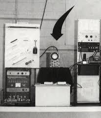

=======
# Alex Christie's Maker Lab Log (2013-14) 

#July 29

##Questions for revision

* Let me know what you think of the names mentioned in the second paragraph. The actual list is much longer (the working bibliography should cover it).

* Let me know if you have any feedback on the use of quotations and citations in-text. Have we set best practices for hyperlinking content from books? Is Google the way to go?

* I'm curious to hear your feedback on my approach to emulation. It could be a tricky area to navigate.

##Completed draft of blog post on gaming kit.

I’ve recently been conducting research for the kits for cultural knowledge series, focusing on a physical computing kit directed toward an archaeology of early video games. The games I’ve been examining were created before the rise of major game consoles and companies in the mid 1980s, games whose graphics, sound, and gameplay mechanics are often deeply enmeshed in the technological constraints of the platform(s) on which they ran. Many of the techniques used to run these games on early arcade and home machines are being revived today by the indie game movement, although tracing a direct line from current indie games back to early video games risks misconceiving of these techniques as purely aesthetic. As Carl Thierrien points out in Mark Wolf’s recent collection Before the Crash: Early Video Game History: "Even with firsthand experience, one can misinterpret the actual algorithmic complexity of a game. This raises the fundamental question of the researcher's competence to examine historical objects..." (13) Studying early video games from a historical perspective therefore invites an experiential, hands-on knowledge of the component material properties of game platforms and their role in shaping the game(s) produced.

A physical computing kit on early games is meant to address the materialist and tinker-centric experience that a history of video games calls for, blending physical computing components, 3d models, schematics and multimedia with text-based scholarship; the goal of such a kit is to provide an embodied scholarly experience that makes an argument about the location of an early game within larger cultural and political histories of technology. This approach is informed by Ian Bogost and Nick Monfort’s Platform Studies series, building on scholarship by Steve Jones, George Thiruvathukal, and Jimmy Maher, among many others. For the rest of this post, I’ll discuss William Higinbotham’s 1958 game Tennis for Two as a case study for a physical computing kit, and conclude by sketching out a few future directions for this project.

Created in 1958 at Brookhaven National Laboratories, Tennis for Two is considered one of the first early video games (and is often seen as a predecessor to PONG). Its creator, William Higinbotham, sought no patent for the game, which led to Higinbotham’s involvement in a patent dispute involving the Magnavox Odyssey’s Tennis game and Atari’s PONG, among others. These better-known video games came decades after Higinbotham’s creation, when early arcade platforms that blended analog and digital computing sat alongside mechanical coin-ops in arcades (and began to enter the home). Unlike these later, and often better-known ball-and-paddle games, Tennis for Two, was completely analog.  It was created using a Donner Model 30 analog computer and an oscilloscope as the graphical display; as Higinbotham writes in his [notes on the game]( http://www.bnl.gov/about/docs/Higinbotham_Notes.pdf), “the instruction booklet that came with this analogue computer described how to generate various curves on the cathode-ray tube of an oscilloscope, using resistors, capacitors and relays.” The analog computing that made the game possible is central to an archaeology of Tennis for Two, which understands the graphical display of the game as a function of its hardware platform. Tinkering with the construction of the game using schematics, an oscilloscope, and a programmable microcontroller can provide a tacit, hands-on experience of how the game’s graphical and mechanical elements are tied to the constraints of its original hardware, an experience that reading alone cannot provide. Even with the original Donner analog computer simulated using an arduino microcontroller, a kit on Tennis for Two would allow scholars to work through historical and political contexts which gave rise to the game’s tennis-based mechanic.

The development of Tennis for Two can be traced back to the computing functions of the Donner Model 30, whose instruction booklet provided examples for calculating ballistic missile trajectories, bullet trajectories, and a bouncing ball (accounting for gravity and wind resistance). The use of the oscilloscope to display these trajectories also has an earlier historical precedent: before researching at Brookhaven, Higinbotham developed the first CRT-based radar displays at the MIT Radiation Laboratory, which were later implemented as the radar tracking system for the B-52 bomber. Again, in his notes, Higinbotham writes: “This involved designing means to present the echoes returned from distant targets on cathode-ray tubes, in angle and distance, not far from the problems involved in the tennis game display.” Higinbotham also developed electronics for nuclear bomb deployment as part of the Manhattan Project. With this in mind, the graphics and mechanics of Tennis for Two are deeply embedded in the link between early computing and World War II, since they emerge directly from computing tasks first developed for missile tracking. Working through the construction of the game through a hands-on kit therefore makes a tacit argument about the historical context for Higinbotham’s game, and does so not by treating the game’s attributes as purely aesthetic, but rather as mechanisms and algorithms that can be tried and tested by the scholar (and which are far from ahistorical). Using computational methods for tracking ballistics during the second world war in order to (re)produce the platform for Higinbotham’s game provides an physical argument about Tennis for Two that reading alone cannot provide; this experiential, situational knowledge of early game platforms is what a physical computing kit seeks to offer.

Notably, Tennis for Two is not the only early video game that employed analog computing. As Karen Collins notes in “One-Bit Wonders: Video Game Sound before the Crash,” early home and arcade video games used digital methods to drive analog sound generators, including beepers (piezoelectric speakers), programmable sound generators, and even four and eight-track tape players. Music for these early games was written in low-level assembly language. Rather than being abstracted from the hardware of the machine, early game sound was deeply embedded in the constraints of the hardware at hand. The PONG sound, for instance, was created using the onboard sync generator (rather than a dedicated sound generator). This resulted in multiple versions of sound for the same game, which changed depending on the material components of each platform.

https://www.youtube.com/watch?v=d4EeF_nM0iY

The transition from analog to digital methods for producing early video games largely existed before the formation of the game industry as we currently know it. Today, many aspects of these early games are accessible thanks to emulation software and retro indie games. The availability and accessibility of physical computing components now lets us tackle which aspects of early video games emulation alone cannot account for, and to consider new infrastructures for accessing the materiality of early games and game platforms. Understanding the material and historical conditions for many of these early game technologies reveals their place in the longer history of the twentieth century. These histories include the links between computing and the second world war, but also the rise of mechanical gambling and other amusement devices and penny arcades which began in the nineteenth century, the changing shape of the post-industrial city, and the ties between computing and labor (topics which Errki Huhtamo explores in “Slots of Fun, Slots of Trouble”). Uncovering an archaeology of early video games through a hands-on approach to the materiality of their platforms will leverage advances in physical computing to share embodied experiences that locate game technologies in cultural and political histories. By providing a method for tinkering with, rather than simply describing, early game platforms, the kit will ideally prototype new methods for producing and sharing scholarship on video game archaeology.

Working Bibliography

[Burnham, Van. *Superarcade: A Visual History of the Videogame Age 1971-1984*]( http://www.amazon.ca/dp/0262524201). Cambridge, MA: MIT Press, 2003.

[DeMaria, Rusel and Johnny L Wilson. *High Score!: The Illustrated History of Electronic Games*]( http://books.google.ca/books?id=HJNvZLvpCEQC&dq=high+score!&hl=en&sa=X&ei=k8bsUdLFF6KRiALc74GICg&redir_esc=y). Berkeley, CA: McGraw-Hill/Osborne, 2002.

General Instruments, [AY-3-8910/8912 Programmable Sound Generator Data Manual](http://dev-docs.atariforge.org/), 1979.

[Herman, Leonard. *Phoenix: The fall and rise of videogames*]( http://books.google.ca/books?id=duITAQAAIAAJ&q=phoenix+the+rise&dq=phoenix+the+rise&hl=en&sa=X&ei=GcXsUanoMIKxiwKmx4HgDA&redir_esc=y).

Juul, Jesper. [*Half-Real: Videogames between Real Rules and Fictional Worlds*]( http://books.google.ca/books?id=lhkhKQEACAAJ&dq=juul+half-real&hl=en&sa=X&ei=tJz1UamjHoGPiALxqIAY&redir_esc=y). Cambridge, MA: MIT Press, 2005.

Karen Collins. [*Game Sound: An Introduction to the History, Theory and Practice of Video Game Music and Sound Design*]( http://books.google.ca/books?id=gnw0Zb4St-wC&printsec=frontcover&dq=collins+karen+game+sound&hl=en&sa=X&ei=ypz1UdXCNoisiALa94CQDQ&ved=0CDoQ6wEwAA#v=onepage&q=collins%20karen%20game%20sound&f=false). Cambridge, MA: MIT Press, 2008.

[The Life and Death of the American Arcade](http://www.theverge.com/2013/1/16/3740422/the-life-and-death-of-the-american-arcade-for-amusement-only).

Montfort, Nick and Ian Bogost. [*Racing the Beam: The Atari Video Computer System*]( http://books.google.ca/books?id=DqePfdz_x6gC&printsec=frontcover&dq=racing+the+beam&hl=en&sa=X&ei=3Zz1UeuaG8OjigLxg4DwDA&ved=0CDEQ6wEwAA#v=onepage&q=racing%20the%20beam&f=false). Cambridge, MA: MIT Press, 2009.

Raessens, Joost and Jeffrey Goldstein, eds. [*Handbook of Computer Game Studies*]( http://books.google.ca/books?id=LJKKKQEACAAJ&dq=handbook+of+computer+game+studies&hl=en&sa=X&ei=85z1UZnnGeS8igKu0oHQCw&ved=0CDEQ6wEwAA). Cambridge, MA: MIT Press, 2005.

Steven L. Kent. [*The Ultimate History of Video Games*]( http://books.google.ca/books?id=PTrcTeAqeaEC&printsec=frontcover&dq=kent+ultimate+history+of+video+games&hl=en&sa=X&ei=CJ31Ud28JcXRigLwjIDwAw&ved=0CDEQ6wEwAA#v=onepage&q=kent%20ultimate%20history%20of%20video%20games&f=false). New York: Three Rivers Press, 2001.

Wolf, Mark J.P. [*Before the Crash: Early Video Game History*](http://books.google.ca/books?id=oK3D4i5ldKgC&printsec=frontcover&dq=before+the+crash&hl=en&sa=X&ei=4qD1UZO9DqOjiAL2v4HgBg&redir_esc=y#v=onepage&q=before%20the%20crash&f=false) Detroit: Wayne State U P, 2012.

#July 28
##Read chapters from *Before the Crash* and prepped blog post

* Received book through ILL

* Wolf, Mark J.P. [*Before the Crash: Early Video Game History*](http://books.google.ca/books?id=oK3D4i5ldKgC&printsec=frontcover&dq=before+the+crash&hl=en&sa=X&ei=4qD1UZO9DqOjiAL2v4HgBg&redir_esc=y#v=onepage&q=before%20the%20crash&f=false). Detroit: Wayne State U P, 2012.

##Wolf, Mark. INTRODUCTION.

Crash began around 83/84  or Q4 '82 (when profits plummeted); ended with release of NES in ‘85. Fall of arcade gaming and rise of big consoles.

"At present, a disproportionate amount of scholarship in video game studies is concerned with games from the last ten years or so, while earlier games are often neglected. This is partly due to a lack of familiarity with (or interest in) the older games, the lack of availability of the older games, or even the games' perceived primitiveness when compared to contemporary video games." (2)

This was also a time when digital games sat alongside mechanical counterparts (cc: Huhtamo).

##Thierrien, Carl. “VIDEO GAMES CAUGHT UP IN HISTORY.”

"Even with firsthand experience, one can misinterpret the actual algorithmic complexity of a game. This raises the fundamental question of the researcher's competence to examine historical objects; the ever-changing technical aspect of video games makes this medium even more demanding than cinema." (13)

"Cruise for a Corpse (Delphine Software, Amiga, 1991), Axelay (Konami, SNES, 1992), and Doom (Id Software, DOS, 1993) have all been promoted as achievements in 3-D graphics, even though neither the manipulation of vector shapes, the ‘mode 7’ bitmap scaling, nor the ‘2.5- D’ texture interpolation engine truly correspond to the contemporary definition of a 3-D game engine." (13)

[MAME](http://mamedev.org/) (multiple arcade machine emulator); also includes fake artifacts to (partially) account for CRT experience.

Draws parallel to early film (pre-Brighton) history, which is (mis)read as laying the groundwork for later narrative techniques; this is a teleological view of the past (that ignores the experimentation involved in early work). Let's not make the same mistake with video games.

"The classic paternity dispute between Willy Higinbotham (inventor of a table tennis game displayed on an oscilloscope, in 1958) and Steve Russell (who "hacked" the PDP-1 supercomputer to create Spacewar! in 1962) points toward the clearest source of teleological distortion in various video game accounts: technology. Since the original technical principle has been developed, a constant onslaught of seemingly perfected yet constantly perfectible machines has been associated with the medium." (19).

"Early video game visuals didn't simply "remediate" older audio-visual media like cinema and television; because of their procedural nature, the visual elements to be assembled and reformulated have long trailed behind the visual realism of their predecessors. Yet this very abstraction is a decisive factor in just how engaging these early games can be." (22). (…bc abstracted primitives are representational interfaces; think pitfall; pac-man, etc.) "The evolution of video game visuals cannot be seen as a simple linear progression toward greater immediacy." (22)

##Huhtamo, Errki. “WHAT'S VICTORIA GOT TO DO WITH IT?”

"Domestic video gaming is one of many media-related rituals repeatedly enacted within the home. It is or has been related with practices such as viewing stereoscopic photographs (a Victorian craze), listening to recorded music or the radio, watching travel slides and home movies, consuming television, text messaging, and surfing the internet." (31)

Long history of tinkering: "Using instructions published in handbooks for boys and in children's magazines, countless Victorian children set out to create their own toy theatres, scrapbooks, and even optical motion toys. The widespread culture of radio amateurism and electrical tinkering was built in the early twentieth century on this foundation, influenced by new generations of hobbyist and popular-science publications and better availability of electrical components. Tinkering with technology has always been part of the world of domestic gaming…" (31)

Victorian domestic media devices: [megalethoscope](https://en.wikipedia.org/wiki/Megalethoscope), stereoscope, stereocards, [phenakistiscope](https://en.wikipedia.org/wiki/Phenakistiscope), zeotrope.

"Radio amateurism led to intense technological do-it-yourself (DIY) tinkering…Radio amateurs gained admiration by their feats, but also notoriety; they were seen as self-made heroes of a new media culture and as prototypical hackers and crackers." (45)

##Collins, Karen. “ONE-BIT WONDERS: VIDEO GAME SOUND BEFORE THE CRASH.”

"There have been several attempts to recreate the video game arcade atmosphere (such as Andy Hofle's [Arcade Ambience Project](http://arcade.hofle.com/)1), and the few existing soundscape recordings have been so popular that they were released on CDs.2" (119)

"Some electromechanical arcade games (pinball, gambling race games, shooting games, etc.) had four-track and later eight-track tape player units incorporated into them to play music and sound effects." (120)

"Sound in video games before the mid-1980s commonly used one of two technologies: beepers or programmable sound generators. Although driven by digital technology, beepers were analog sound generators…although early games used analog circuitry, this sound was typically controlled and manipulated digitally, and was nearly always some form of pulse wave." (122)

Early video games sometimes used a [piezoelectric speaker](https://en.wikipedia.org/wiki/Piezoelectric_speakers#Piezo_tweeter) (a beeper); piezoelectricity: "when mechanical stress is placed on a material--in this case, ceramic--generating electricity and mechanical resonance." (122)

Electromagnetic speakers also use at home (1-bit sound); could digital encode analog sound using high-res counters--in order to produce a larger range of frequencies from the speakers.

The Pong sound was created with the sync generator on the board; in other words, using sounds that were already part of the game's hardware. [Materiality of sound is key for understanding early games as platforms and how their graphics, music, and mechanics are deeply enmeshed in hardware constraints.]

Programmable sound generators (PSGs)…"frequency sweeps could be used for lasers, whistling bombs, race cars, and so on. Doppler and noise sweep effects were useful for racing games, and the noise channel could be used for gunshots, explosions, and other sound effects." (125)

"'The [AY-8910 (and derivatives)](https://en.wikipedia.org/wiki/General_Instrument_AY-3-8910) found its way into a variety of home computers and games consoles including the Sinclair ZX Spectrum, Amstrad CPC, Mattel lntellivision, Atari ST, and Sega Master System. Many video game PSGs were created by GI or Texas Instruments, but some companies, such as Atari and Commodore, designed their own sound chips in an effort to improve sound quality." (125-126)

Early game sounds were programmed in assembly language (pre-MIDI).

Game music had to be done in low-level assembly language; in other words, early game music was not abstracted from the hardware of the machine.

And since sound had to fit into the available memory (which was extremely constrained), it couldn't be separated from the game code, either. And porting sound was extremely difficult. [Versioning early video game sound!](https://www.youtube.com/watch?v=d4EeF_nM0iY]

A few games of note: computer space, pong, touch me (predecessor to Simon), Space Invaders, Pac-Man, Bezerk and Stratovox (1980)--first games to use speech synthesis

##Camper, Brett. “COLOR-CYCLED SPACE FUMES IN THE PIXEL PARTICLE SHOCKWAVE: THE TECHNICAL AESTHETICS OF [DEFENDER](https://en.wikipedia.org/wiki/Defender_%28video_game%29) AND THE WILLIAMS ARCADE PLATFORM, 1980-82.”

[Video of Defender](https://www.youtube.com/watch?v=sBeCJzg6L8I)

Excellent case of platform studies, in which Camper examines how the mechanics (early, fast-paced [SHMUP](https://en.wikipedia.org/wiki/Shoot_'em_up) using off-screen action) graphical properties (and advantages, for their time) of Defender and the Williams Arcade platform are intimately tied to hardware constraints.

[Framebuffer](https://en.wikipedia.org/wiki/Framebuffer) and [tile-map](https://en.wikipedia.org/wiki/Tile_map) methods for computing graphical display using a CRT developed alongside each other in the early 80s.

"From a platform studies perspective, it is key that the particle effects of Defender, so central to its visual style and animation, would have been unavailable on later arcade hardware that from other points of view would be considered more ‘advanced.’” (183)

[Color cycling](https://en.wikipedia.org/wiki/Color_cycling) was also used for Defender (inexpensive and worked for the game), and could be used to animate water, shockwaves, moving lines, etc.

Slow-motion was also used in early games for dramatic effect, although it was the result of the system literally slowing down as the game took too on to process. These slow-motion effects have antecedents in the materiality of early games (very different from film).

##Working Bibliography (for future reference)

[Burnham, Van. *Superarcade: A Visual History of the Videogame Age 1971-1984*]( http://www.amazon.ca/dp/0262524201). Cambridge, MA: MIT Press, 2003.

[DeMaria, Rusel and Johnny L Wilson. *High Score!: The Illustrated History of Electronic Games*]( http://books.google.ca/books?id=HJNvZLvpCEQC&dq=high+score!&hl=en&sa=X&ei=k8bsUdLFF6KRiALc74GICg&redir_esc=y). Berkeley, CA: McGraw-Hill/Osborne, 2002.

General Instruments, [AY-3-8910/8912 Programmable Sound Generator Data Manual](http://dev-docs.atariforge.org/), 1979.

[Herman, Leonard. *Phoenix: The fall and rise of videogames*]( http://books.google.ca/books?id=duITAQAAIAAJ&q=phoenix+the+rise&dq=phoenix+the+rise&hl=en&sa=X&ei=GcXsUanoMIKxiwKmx4HgDA&redir_esc=y).

Juul, Jesper. [*Half-Real: Videogames between Real Rules and Fictional Worlds*]( http://books.google.ca/books?id=lhkhKQEACAAJ&dq=juul+half-real&hl=en&sa=X&ei=tJz1UamjHoGPiALxqIAY&redir_esc=y). Cambridge, MA: MIT Press, 2005.

Karen Collins. [*Game Sound: An Introduction to the History, Theory and Practice of Video Game Music and Sound Design*]( http://books.google.ca/books?id=gnw0Zb4St-wC&printsec=frontcover&dq=collins+karen+game+sound&hl=en&sa=X&ei=ypz1UdXCNoisiALa94CQDQ&ved=0CDoQ6wEwAA#v=onepage&q=collins%20karen%20game%20sound&f=false). Cambridge, MA: MIT Press, 2008.

[The Life and Death of the American Arcade](http://www.theverge.com/2013/1/16/3740422/the-life-and-death-of-the-american-arcade-for-amusement-only).

Montfort, Nick and Ian Bogost. [*Racing the Beam: The Atari Video Computer System*]( http://books.google.ca/books?id=DqePfdz_x6gC&printsec=frontcover&dq=racing+the+beam&hl=en&sa=X&ei=3Zz1UeuaG8OjigLxg4DwDA&ved=0CDEQ6wEwAA#v=onepage&q=racing%20the%20beam&f=false). Cambridge, MA: MIT Press, 2009.

Raessens, Joost and Jeffrey Goldstein, eds. [*Handbook of Computer Game Studies*]( http://books.google.ca/books?id=LJKKKQEACAAJ&dq=handbook+of+computer+game+studies&hl=en&sa=X&ei=85z1UZnnGeS8igKu0oHQCw&ved=0CDEQ6wEwAA). Cambridge, MA: MIT Press, 2005.

Steven L. Kent. [*The Ultimate History of Video Games*]( http://books.google.ca/books?id=PTrcTeAqeaEC&printsec=frontcover&dq=kent+ultimate+history+of+video+games&hl=en&sa=X&ei=CJ31Ud28JcXRigLwjIDwAw&ved=0CDEQ6wEwAA#v=onepage&q=kent%20ultimate%20history%20of%20video%20games&f=false). New York: Three Rivers Press, 2001.

Wolf, Mark J.P. [*Before the Crash: Early Video Game History*](http://books.google.ca/books?id=oK3D4i5ldKgC&printsec=frontcover&dq=before+the+crash&hl=en&sa=X&ei=4qD1UZO9DqOjiAL2v4HgBg&redir_esc=y#v=onepage&q=before%20the%20crash&f=false) Detroit: Wayne State U P, 2012.

# July 23-34

* Met with Jentery and Nina to discuss posts on the kits.
* I'm not finding many articles on Tennis for Two. It's ties to the manhattan project are, however, mentioned in the *Handbook of Computer Game Studies* and Burhnam's *Superarcade: A Visual History of the video Game Age*, which I'm having a hard time finding, although the [preview](http://www.amazon.ca/dp/0262524201) on Amazon has a few useful pages.

##Thought about potential for accounting for indie gaming

It looks like the ethos of early games (pre-Bushnell) is heavily invested in making and tinkering. It's anachronistic to call these early games indie, but they do set a precedent for the development interests that emerge around the indie movement (and critical making).

"Not only would seeking royalties contradict the hacker ethos revered by these early computer geniuses, but also likely is the fact that the system Spacewar is running on is the size of three refrigerators and costs $120,000." See more at: http://thedoteaters.com/?bitstory=spacewar#sthash.aNnm1bGh.dpuf

"And computing is just a fabulous place for that, because it’s a place where you don't have to be a Ph.D. or anything else. It’s a place where you can still be an artisan." From [Rolling Stone piece](http://www.wheels.org/spacewar/stone/rolling_stone.html).

"The programs and stuff just lived in there, just raw seething octal code. And one of the guys wrote a program called 'The Unknown Glitch,' which at random intervals would wake up, print out I AM THE UNKNOWN GLITCH. CATCH ME IF YOU CAN, and then it would relocate itself somewhere else in core memory, set a clock interrupt, and go back to sleep. There was no way to find it." From [Rolling Stone piece](http://www.wheels.org/spacewar/stone/rolling_stone.html).

##Tennis for Two

Other resources:

* [Brookhaven National Laboratory site](http://www.bnl.gov/about/history/firstvideo.php)
* [Schematic 1](http://www.bnl.gov/about/docs/VideogameSchematic1.jpg)
* [Schematic 2](http://www.bnl.gov/about/docs/VideogameSchematic2.jpg)
* [Higinbotham's Notes](http://www.bnl.gov/about/docs/Higinbotham_Notes.pdf)
* [Higinbotham's '76 Deposition](http://www.bnl.gov/about/docs/Higinbotham_Deposition.pdf)

##On Graphics

Read up on [vector graphics](http://en.wikipedia.org/wiki/Vector_graphics). Another instance of early video game design techniques that have been re-introduced by recent indie games.

 
[Kentucky Route Zero](http://kentuckyroutezero.com/)
: Vector Graphics

[Superbrothers: Sword and Sworcery](http://www.swordandsworcery.com/)
: Pixel Art

### Jentery's Feedback on 23-24 July Log

Great stuff, Alex. Given your point about anachronisms, what do you think about "gaming before the gaming industry" (or the like)? Whatever the case, curious to see how many correlations there are between hardware hacking and tinkering cultures and early gaming cultures. 

In Higinbotham's notes (http://www.bnl.gov/about/docs/Higinbotham_Notes.pdf), have you checked out the patents referenced at the bottom (on page 6)? Whatever the case, these notes are very informative, and they would be great components of a kit. For now, then, what do you think should be the next steps for the kit? In order to make the story more concrete (for it to function as a recipe of sorts), what information / materials do we need? 

### Alex's Reply

I'll work this up and produce a draft blog post on directions for a gaming kit (including our research thusfar on Tennis for Two, while also gesturing toward archeologies of early video game sound and graphics). As the case of Tennis for Two shows, the historical and cultural contexts for the hardware in question will, I think, be key. More from me soon!

# July 21

At this point, the Spacewar and (especially) Tennis for Two look like the two most promising options (depending on our goals for the kit). I spent the day looking further into these two games, as well as investigating other potential avenues of entry for the kit.

##Spacewar

* [Playable Web Version](http://spacewar.oversigma.com/html5/) and [original source code](http://spacewar.oversigma.com/sources/)

* The missiles in the game remain unaffected by the gravitational pull of the star because the processing time of the PDP-1 was too slow to account for this.

* The game was originally controlled by switches alongside the display, which wore out quickly. Joysticks came later.

* The first mod/update for a game was called "Expensive Planetarium"--and replaced the randomly-generated starfield in the game with an accurate background based on star charts.

* Other research games tinkered with the source code to make their own flavors of the game. Could be seen as the first instance of a [modding](http://en.wikipedia.org/wiki/Video_game_mod) community.

* [Article](http://thedoteaters.com/?bitstory=spacewar) at The Dot Eaters.

* [1972 Rolling Stone article on Spacewar](http://www.wheels.org/spacewar/stone/rolling_stone.html)

##Tennis for Two

* Completely analog! Created using a Donner Model 30 analog computer and an oscilloscope as the graphical display.

* The game explores the transition from analog to digital games, situated in a longer history of the Twentieth Century, with ties to labor (as Huhtamo argues in "Slots of Fun, Slots of Trouble.") The analog/digital shift indicates a larger historical context for this game, while also tying into physical computing and the rise of the internet of things. Looks promising.

* [Schematic](http://scienceblogs.com/brookhaven/wp-content/blogs.dir/357/files/2012/04/i-0dd7c7443a36c2364076df19e409648a-VideogameSchematic1.jpg) for the original game.

* Like all of these early games, Tennis for Two has been recreated. Here's an [entry](http://www.evilmadscientist.com/2008/resurrecting-tennis-for-two-a-video-game-from-1958/) explaining one process for remaking the game. This process uses an oscilloscope and an AVR microcontroller. So this recreation isn't fully analog. What options could be explored in a kit? Arduino? Do analog options exist?

* Here's [another DIY kit](https://www.tindie.com/products/wmbuchholz/ttl-tennis-for-two/) for this game. Looks like there's a precedent for an early gaming kit in the hobbyist scene.

* [Article](http://thedoteaters.com/?bitstory=tennis-for-two) at The Dot Eaters.

* Short [article on the game](http://www.atarimagazines.com/cva/v1n1/inventedgames.php). The technical details provided toward the end of the piece are of note.

##Other Items of Note

* The joystick is not the first controller form. The paddle derives from early tennis games and its link to the scientific instruments used as the platform for *Tennis for Two*.

* First graphical game is [OXO](http://en.wikipedia.org/wiki/OXO) (tic-tac-toe): 1958.

* [Cathode Ray Tube Amusement Device](http://en.wikipedia.org/wiki/Cathode_ray_tube_amusement_device) is another very early game.

* [NIMROD](http://www.goodeveca.net/nimrod/) is another. Playable web version [here](http://www.goodeveca.net/nimrod/GAME/index.html).

### Jentery's Feedback on 21 July Log 

I love that the Spacewar article is by Stewart Brand (the Long Now guy). And again, just be sure to grab images from the web and save them in your repo. For instance, that schematic of Tennis for Two might be taken down tomorrow. Saving it (rather than pointing to it) for future reference is a good idea.  

This post --- (http://www.evilmadscientist.com/2008/resurrecting-tennis-for-two-a-video-game-from-1958/) --- is very informative. Thanks for the ref! I think we have a bit to learn from this approach, and (as I mentioned yesterday) I'm starting to realize how the games kits (when compared with the audio and wearables kits) might be a touch more technically complex. Still, I'm really keen on the idea of producing (at least) a controller, which works with either a digital version of Tennis for Two or the analog, oscilloscope version. The problem with the latter approach is that oscilloscopes are very expensive. (We should have one in the lab soon.)   

### Alex's Reply

Thanks, Jentery! This sounds great. Looking into methods for producing early game sound and graphics might also prove fruitful.

# July 20

##Read two chapters from [*Handbook of Computer Game Studies*](http://books.google.ca/books?id=LJKKKQEACAAJ&dq=isbn:0262516586&hl=en&sa=X&ei=t7_sUeWXA8qTiALxioEg&redir_esc=y). Notes below.

Raessens, Joost and Jeffrey Goldstein, eds. *Handbook of Computer Game Studies*. Cambridge, Mass.: MIT Press, 2005.

I also looked at some of the hardware mentioned in these chapters at a local game store, which has an Atari 2600, Odyssey, and a few paddle controllers (inspired by Tennis for Two's analog, pre-joystick controller). Another store carries two coin-ops, but I believe they're both from the 80s.

##Huhtamo, Erkki. "SLOTS OF FUN, SLOTS OF TROUBLE: AN ARCHAEOLOGY OF ARCADE GAMING."

"The pilgrim in the microworld (1983), an early, unjustly neglected analysis of electronic gaming…the most detailed description of the psychophysical bind created between the player and the game (and, by implication, the user and the computer)." (3)

"The history of coin-operated arcade video games is routinely said to begin with the appearance of Nolan Bushnell's Computer Space (1971) and Pong (1972), that of home games with the introduction of Magnavox Odyssey (1972), the rst video game console for domestic use, conceived by Ralph Baer, with Bushnell another founding father." (4)

"The main predecessor to these landmarks has been identified in Spncewar, associated with the name of Steve "Slug" Russell, but actually created by a group of student-hackers at MIT in the early 1960s, and subsequently improved collectively by other students at the computer science departments of various American universities throughout the 1960s." (4)

Another option for 'prehistory' is "Tennis for Two."

Positions industrial revolution as cultural/historical antecedent for human-machine interaction.

“…the second half of the nineteenth century, a line of different machines appeared…[placed all over, eventual moved into penny arcades]…Particularly from the 1880s on, many different types of machines were developed: vending machines, 'trade simulators,' gambling machines, strength testers, fortunes-telling machines, electric shock machines, games machines, automated miniature theaters…viewing and listening machines, automatic scales. These devices have come to be known by the generic terms 'slot machines,' 'coin machines' to 'coin-operated machines' (coin-ops), referring to their basic principles of operation…the user begins the session by inserting a coin in slot. The machine gives something in return: a postcard, candy or cigar, a "therapeutic" electric shock, a ceipt with one's weight or fortune, a visual or musical performance, an amusing joke, a psychologically or so:ially encouraging experience, an opportunity to train me's skills, enjoy a sharp-shooting session or-last hilt .at least-a possibility to turn one's initial investmcnt into a shower of coins.” (7)

Differentiates between automatic and proto-interactive machines.

Automatic machines often involved automata (spectacle, magic circle).

"Yet, anticipating the popular arcade game Dance Dance Revolution Konami), there were also machines operated by one's feet. To excel in a more unexpected variant, the "Lion lead Lung Tester" (Mills, 1904), one needed to blow lard in a pneumatic tube to make a mechanical lion roar and flicker its eyes." (10)

Identifies pinball as a mechanized version of the Victorian parlor game bagatelle (pinball introduced in 30s).

These mechanical games also fit into the fabric of the post-industrial city life. Cites irony that machines whose antecedent is labor are played precisely for leisure. Particularly interesting in its original historical context.

"One should not neglect the fact that women who had entered me working life as typists and telephone operators were often in more direct contact with the latest technology than males. Although, as Ellen Lupton has shown, they were relegated to the role of mediator and thus segregated /Tom power and decision making, they would have been at ease with new machines, including coin-ops (Lupton, 1993)." (11)

Many children excluded from these games…inscribed into UIs of many of the games, themselves (i.e. height & strength). Games for kids rose over 20C (another history of rise of kid leisure at work here, too).

Crackdown on games/spaces seen as vices…slot machine industry switched to offering replays, & high scores as reward…pinball was key in this transformation…big in late 40s (rise of postwar youth culture).

Continuity between mechanical and digital games visible in 70s…as digital games were phased in alongside older mechanical counterparts.
History of interface in earlier games…"this connection has been symbolically expressed in a story about Steve "Slug" Russell, one of the creators of Spacewar. Russell is said to have exclaimed, many years after working on me game, as if struck by a sudden revelation: "By gosh-it is a pinball ... machine!" 48). (15)

##Malliet, Steven and Gust de Meyer. "THE HISTORY OF THE VIDEO GAME."

"Prehistory: 58-62"

"[Willy Higinbotham] converted an oscilloscope (a machine that transforms vibrations into a wavelike motion n a screen) into a kind of pinball game. A speck of light moved across the screen and with the help of two boxes with push buttons one could control the curve it followed. He considered his creation an abstract simulation of the game of tennis, and aptly named it 'Tennis for two.’" (23).

Other antecedents to early games: coin-ops, board games (monopoly), & RPGs (D&D).

Steve Russell (MIT student) "Technically speaking, Spacewar can he seen as the first game, simply because it was the first "game" hat was programmed on a "computer." (24.)

Ralph Baer (engineer): tennis & hockey simulators playable on TV.

Nolan Bushnell: computer space (inspired by spacewar; differed from others bc it was an arcade game). Bushnell thought about interface, profit, design (key to what distinguished his games from others).

"[Bushnell] managed to take video games lout of the sphere of scientific research and bring them to the general public" (25).

Tank (74): "the first game to use ROM chips to store graphics, making them far more accurate, The use of separate ROM chips for graphics can be seen as an early precedent of the graphics cards known today." (26). 

Gun Fight (75) first game to use microprocessors; also introduced early peripheral devices (i.e. joystick, fake guns). First game to use graphics more than just blips, graphic that looked like the object they represented.

Odyssey (72) first console (Magnavox bought license from Baer to make home version). Fully analogue system! All possible games were programmed into console, itself. Black and white; color was added by putting screens over CRT.

Atari makes Home Pong in 74 to compete with Odyssey.

 
76: Studio II and Channel F (first programmable, cartridge-based consoles)

77: Atari 2600 (first major home console)

Go'Cha: first maze game; predecessor to Pac-Man.

Death Race (76) first violent, controversial video game.

Another history of piracy of early video games: stealing source code and rebranding it as similar game.

Space Invaders (78): Japanese, emerges from history of Pachinko, etc., first rhythm & story-based game

Pac-Man (81) also Japanese--Namco

Space Panic (81): first climbing game

Donkey Kong (81)

Zaxxon (82, Sega): first game to use isometric perspective

Adventure (79, Atari 2600): first adventure game to use graphics

[Interesting how content and materiality are intermeshed--materiality of interface and its role in dev. of genres, medium]

Defender (81) first side-scroller (space shooter) also first game with off-screen action

Simon (74, Milton Bradley): first handheld

Famicom (Nintendo console, 83): Mario Bros.

Super Mario Bros. (85)

Famicom sold in US as NES (86)

Sega Master System (86)

Gameboy (89): first handled to use cartridges, first "handled computer games"

Tetris was killer app for Gameboy

 
Isometric perspective (Zaxxon) introduced third-person, top-down view, and influenced later strategy games (SimCity, Civilization).

The Legend of Zelda (86)

##Other resources

[*The Ultimate History of Videogames*]( http://books.google.ca/books?id=PTrcTeAqeaEC&printsec=frontcover&dq=isbn:0307560872&hl=en&sa=X&ei=6cTsUdruNqS-igKCtYDoAQ&redir_esc=y#v=onepage&q&f=false)

[Herman, Leonard. *Phoenix: The fall and rise of videogames*]( http://books.google.ca/books?id=duITAQAAIAAJ&q=phoenix+the+rise&dq=phoenix+the+rise&hl=en&sa=X&ei=GcXsUanoMIKxiwKmx4HgDA&redir_esc=y) -- focuses on development of game hardware

**[Burnham, Van. *Superarcade: A Visual History of the Videogame Age 1971-1984*]( http://www.amazon.ca/dp/0262524201) -- looks excellent**

[DeMaria, Rusel and Johnny Wilson. *High Score!: The Illustrated History of Electronic Games*]( http://books.google.ca/books?id=HJNvZLvpCEQC&dq=high+score!&hl=en&sa=X&ei=k8bsUdLFF6KRiALc74GICg&redir_esc=y) -- focuses on games and development of 'game aesthetics'

## Halo 2600

Very interesting [homebrew](https://en.wikipedia.org/wiki/Homebrew_%28video_games%29) game. A version of Halo developed for the Atari 2600 platform (deployed as web game and as playable Atari 2600 cartridge).

* [Web Version](http://www.codemystics.com/halo2600/)
* [Atari 2600 Cartage](http://www.atariage.com/store/index.php?l=product_detail&p=1015)
* [Gameplay Video](http://www.youtube.com/watch?v=GwmuF-j3DiQ)

### Jentery's Feedback on 20 July Log 

Just a quick request, Alex: be sure to save your images to your local drive and then include / push them in your repo. That way, down the line, we have access to them (just in case they are removed from the interweb.) Thanks! 

Generally speaking, this research looks pretty solid to me. And I agree: Tennis for two might be our best kit (for now). Thanks! 

### Alex's Reply

Sure thing. Thanks!

# July 18-19

Began researching early history of arcade games.

## Books

* [*Handbook of Computer Game Studies*](http://books.google.ca/books?id=LJKKKQEACAAJ&dq=isbn:0262516586&hl=en&sa=X&ei=t7_sUeWXA8qTiALxioEg&redir_esc=y) -- checked out from UVic library collections.

* [*Before the Crash: Early Video Game History*](http://books.google.ca/books?id=oK3D4i5ldKgC&printsec=frontcover&dq=early+video+game+history&hl=en&sa=X&ei=9H_pUcrgH4zQigLpooF4&redir_esc=y#v=onepage&q=early%20video%20game%20history&f=false) -- requested through ILL

## Videos

* [Early 1980s Video Arcade Games](http://www.youtube.com/watch?v=C5er7gJ4uto)

* [History of Video Games](http://www.youtube.com/watch?v=empni1yCPqw)

### Jentery's Feedback on Week of July 15th

No research thus far this week? Feel free to publish material as you're producing it. With the summer nearing an end (and the lab closed in August), I'm hoping we have sufficient material to start sketching a gaming kit. Thanks, A!

# July 10

* Revised abstract draft for group review
* Edited INKE abstract with Jentery and Nina
* Discussed gaming kit with Jentery

### Jentery's Feedback on 4, 8, 10 July 2013 Logs

In the logs, don't forget to: 1) add draft material of what you're writing / working on, 2) include issues you're encountering or questions you have, and 3) point to resources you're using / reading. Thanks, A!

# July 8

Worked on INKE abstract & met with Nina to discuss.

# July 4

* Finished drafting blog post (copied below)

### Jentery's Feedback on 4 July 2013 Log 

Looks like "Thinking through Infrastructure" went over well with folks in the field. Good stuff, Alex! 

##Notes on draft

* What names are missing at the end of the second paragraph?

##Thinking Through Infrastructure

We’ve recently completed a review of our shared workflow in the lab, focusing on how we manage our collaborative tasks, log our research, and share our discoveries with each other and with a larger public online. As part of my research this summer, I’m testing and implementing our workflow as we look toward the kits for cultural history and z-axis initiatives in the coming year. I want to examine our workflow method in the lab, focusing on it’s role in scholarly communication, scaled collaboration, and graduate student professionalization.

As my title suggests, the tools, practices, techniques, and shared values not only inform the work we do, but also reflect our shared praxis and its relation to humanities scholarship. As Alan Liu has recently suggested: “Just as meaning [in the Digital Humanities] is both a metavalue and a metaproblem, so is collaboration as it bears on such urgent issues in the digital humanities as coauthorship, collective project building, multigraph books, open peer review, social media, crowdsourcing, and the hiring and promotion implications of all these.” Thinking critically about how we work as a team allows graduate researchers to explore the place of their work in relation to emergent changes in the discipline, and to do so through the everyday practice of research. As such, our choices about infrastructure emerge from discussions at the recent Scholarly Communication Institute meetings on [Rethinking Graduate Education](http://uvasci.org/current-work/graduate-education/), and respond to changes in the discipline advocated by Bethany Nowviskie, Kari Kraus, and Kathleen Fitzpatrick.

As I begin reading for my comprehensive exams in the Digital Humanities this Fall, working through digital methods as they register changes in the discipline more broadly adds an embodied, engaged, and tacit element to my graduate education that reading alone cannot provide. I will therefore pull back for an overview of the landscape of tools and practices we’ve chosen to implement before returning to a view on the ground, where I will discuss the importance of humanities lab infrastructures in rethinking how graduate students approach their research.

The Maker Lab’s workflow is divided into three principal sections: task management, logs, and blog posts. My time in the lab usually begins with a quick review of my ongoing projects and deadlines, which we manage using Asana. Asana’s web application lets us set due dates for tasks, share draft documents and other resources we’ve discovered, and send brief updates on the status of our work. By consolidating project updates, progress, and deadlines into one place, Asana eliminates the need to dig through my inbox before returning to work on a project. Reducing e-mail is key to ensuring that project details don’t become fragmented and that collaborators remain updated with ease.

Logging our work in the lab is managed through GitHub, using a shared logs folder in the lab’s repository. Each log is maintained as a markdown file, with new shifts added under a header for each date. For each lab shift, I typically log a list of work done along with screen grabs and a list of ideas and concerns for the day. These updates are then pushed from my local machine to the main branch using the GitHub client. This method allows us to maintain local access to our logs without relying on internet access. Pushing updates through text and screen grabs to the shared repository online (where the markdown is displayed as html) also asks researchers to work through how this becomes that as we compose and format our logs, push them from our local machines, and maintain conversations via GitHub. Working through GitHub promotes the concerns and approaches we share in the lab, and it does so by asking collaborators to focus not only on what work we do as a team, but how we do it.

We also use GitHub to facilitate conversations between researchers and directors. In my experience, the log functions more as a conversational space than a record—I push the work I’ve done in a shift along with thoughts, roadblocks, and concerns, which are then taken up using the comments function in GitHub. The blend of online communication (using comments in Asana and GitHub) and face-to-face collaboration (in the space of the lab) creates a feedback loop through which record keeping becomes a venue for articulating and working through new ideas about the work we do. In a lab whose focus is on humanistic inquiry, cultivating these moments of shared critical reflection through the platforms we use promotes the blend of algorithmic and critical inquiry that lies at the center of digital humanities research.

The findings of our work is shared with a larger public through blog posts to the Maker Lab website. We each author roughly two posts per semester, with progress toward completion tracked using Asana, drafts and working thoughts shared via our logs, and final drafts submitted for review before being published on the site. Integrating the documentation we generate across a range of media is a key element of composing the posts. So far, we’ve worked with video and audio, posters, exhibits, fabricated objects, and a range of tools, methods, and texts. Communicating our work through a suite of media, from screengrabs, to text, to high definition video, invites us to work through platforms and strategies for sharing digital work on the web.

Together, these three key elements of our shared workflow—task management, logging with GitHub, and authoring blog posts—compose a set of shared resources and methods that teach us how humanities research can be collaboratively undertaken and shared with larger communities. However, these screen-based interfaces are also blended with hand-driven counterparts maintained in the space of the lab. Planning meetings for new projects always begin at the whiteboard, where we work through our thoughts as a group and draft them on the board. New items of interest are displayed on the large monitor in the lab, and often prompt discussion as we turn from our workstations to discuss our shared problems in person. Questions about a research problem are solved by pulling a book from the shelves in the corner and consulting with a neighbor. When I conceive of shared workflow as lab infrastructure, I don’t only refer to a set of tools and tasks, but also to the objects, surfaces, and spaces through which collaborators share their ideas.

Communicating through these resources, both on-screen and in-hand, lets us conceive of our graduate work at a range of scales. While devising my workflow for a new task, I will also think about how that workflow could be shared via GitHub for others to fork and deploy at their home institutions. Working in the lab asks me to consider what material collaborative projects and spaces produce and what venues, methods, and media exist for sharing that material with others engaged in similar work. I find that as we conduct our daily research in the lab, my fellow graduate researchers and I continually assess how scholarly communication functions across a range of scales, from the collaborator across the room, to research partners on skype, to local and larger disciplinary communities. By enmeshing research practices in shared infrastructure, our workflow reconceives of solitary research activities as collaborative practices that engage larger publics.

Liu, Alan. “The Meaning of the Digital Humanities.” *PMLA.* 28.2 (March 2013): 409-423. Print.

### Jentery's Feedback on the Log for 4 July 2013

I love the draft post, and I'll be editing it and publishing it on the blog soon, likely tomorrow (Friday the 5th). Cool? Thanks, Alex! 

# July 3

* Continued drafting blog post on workflow

#July 2

* Drafted blog post on workflow

#June 28
## Reviewed content on SCI Site

###Read [Rethinking Graduate Education, Meeting 1](http://uvasci.org/wp-content/uploads/2012/09/final-report.pdf)

* Integrating shared workflow and blog posting into existing lab infrastructure (as the site addresses a larger public) offers a venue for graduate students to think about how work in and around DH centers scales across a variety of contexts (a consideration typically reserved for those higher up the chain).

###Read [Rethinking Graduate Education, Meeting 2](http://uvasci.org/wp-content/uploads/2013/01/Report_SCIGradEd_11MAR13.pdf)

* Stop focusing on describing data and start producing it. Scholarship doesn't describe things; it does things.
* How does workflow integrate into MA & PhD career/trajectory planning?
* Could riff on concept of exchange, particularly across different levels of prof. dev. What does it mean to exchange/conversate with colleagues at various levels across various projects?
* …but also reframing. Again, the content/method split is a false binary. Id' suggest the answer rather lies in shared sets of *problems* that we work through collaboratively.

###Reviewed ["Survey of DH Centers in the US"](http://www.clir.org/pubs/abstract/reports/pub143)

* How does our workflow respond to the issue of DH centers becoming silos? How do we *exchange* and collaborate across a range of scales--in the lab, on campus, with our colleagues at various institutions, and with a broader public? These aren't considerations that become tacked-on at the last minute as we present our work for public display, but are rather baked into the way we work and think together on our projects/problems.
* How does scholarly communication & collaboration scale up from the local level? I'd suggest that thinking about workflows as shareable, interoperable, and refractable is key.

###Read ["In Search of Hard Data on Nonacademic Careers"](http://chronicle.com/article/In-Search-of-Hard-Data-on/134030/#disqus_thread)

###Read ["Rebooting Graduate Education in the Humanities"](http://chronicle.com/blogs/conversation/2013/01/07/rebooting-graduate-education-in-the-humanities/)

* Problem-based approaches to collaboration reframes graduate education. The work we undertake together is as much about the scholarly problems we are trying to solve as what methods, skills, and tools we bring together to solve them. Thinking about workflow necessarily involves developing a range of skills and approaches situated within contexts that include, but are not limited to, the traditional work of the academy.

##Began reviewing elements of workflow...

* ...as I think toward drafting the blog post
* Reviewed comments in Asana, GDrive
* Reviewed GitHub interface & visualizations
* Began drafting structure for post
* Began drafting post

##Notes

* One key difference I'm noticing between using Git/GitHub for logs: I felt more comfortable logging incomplete work in a GDoc than I do in an .md file. For instance, the last two notes above feel out of place here. We'll see if my perspective on this changes over time.

### Jentery's Feedback on the Log for 28 June 2013

Don't you love the language around producing data (rather than describing things)? It motivates the lab's research, for sure.  And as you probably guessed, the problems-based emphasis of "Rebooting" is in part informed by my work with Ray on new approaches to modelling and prototyping. I'm also fond of that perspective :) 

Elsewhere, keep me posted on this bit: "I felt more comfortable logging incomplete work in a GDoc than I do in an .md file." What about the absence of the page in a text editor? Or the lack of a WYSIWYG editor? All of which is to say: I'm curious how software design influences your perception of complete / incomplete. To be sure, preferences differ from person to person.   

#June 25
##Drafted Working Notes

* Look into issues tracker in Guthub [also used by Scholarslab folks](http://www.scholarslab.org/grad-student-research/reflections-on-project-management-i/ )
* Importance of thinking through infrastructure (pun intended). Touches on knowing/doing, collaboration, and graduate education.
* Conversations are key (both in-person and online)
* fostering shared culture, shared ways of knowing/doing, and venues for collaboration...
* …in other words, collaboration doesn’t just happen—-it needs to be cultivated
* articulate principles behind shared infrastructure

###Notes from my perspective

* Cohort formation and collaborative planning (how what may be conceived of as a solitary activity is actually embroiled in questions of collaboration, professionalization, the changing profession, and scale). Think of lab planning related to reading group, comps reading & dissertation planning, and appeal of humanities training. Thinking about shared workflow involves rethinking the contexts for graduate work in the humanities.
* Value of this type of training: the role tools play in shared work, project planning, work culture, etc.
* Why is it important for RAs to work through these infrastructures, rather than having them simply passed down from above? Because the underlying issue at stake is humanities training(?)
* Think more broadly about planning communication & collaboration infrastructure for whole lab in the coming year. What issues are we looking toward?
* What are we collecting? What data are we *producing* and how will it be used?

###Looking toward use cases in the coming year

* Forking workflows
* …and, in related practice, publishing workflows we’ve tested  in the lab.
How do labs communicate? What practices can we share and what would that look like?
* What material do collaborative projects/spaces produce and what venues, media, infrastructures exist for sharing that material?
* How does scholarly communication function across a range of scales? On the local level? On the www level? Across research partners? Engaging with a larger public?

### Jentery's Feedback on the Log for 25 June 2013

I like this language and perspective, especially the emphasis on blending technology and culture: "Thinking about shared workflow involves rethinking the contexts for graduate work in the humanities." The comparison with reading groups is compelling, too.  

I also appreciate an inquiry into how labs communicate. Last year, I felt as tho the work was too individuated. Know what I mean? A lot of one-to-one communication (at least in terms of logs) between me and GRAs. It'll be good to open it up and share process? Looking forward to reading more! Thanks, Alex! 
