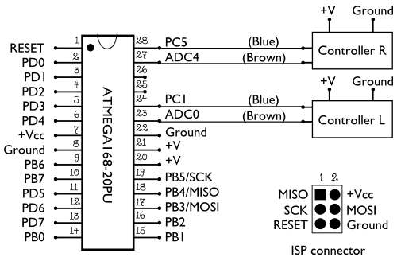
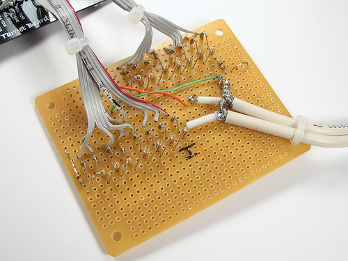

# Jon's Maker Lab Log (2013-14) 

#September 11, 2013

Today I'm going to do some work similar to my last post. That is, trying to dig around and locate sources and schematics for building an actual T42 system while keeping in mind the questions surrounding the historical and technological particulars in making a T42 kit. I'm first taking a quick look at the T42 re-creation made by MEGA--the Museum of Electronic Games & Art.  The "T42" build claims to be "the only existing 100% analog and fully playable reconstruction of Tennis for Two." The rebuild is pretty beautiful; you can check it out [here](http://www.m-e-g-a.org/research-education/research/t42-tennis-for-two/). It's a pretty great build, and is actually much smaller than I might have first thought. I *love* the analog-ness of this build, and it would be great, I think, to attempt to emphasize the analog quality of the original 1958 build as much as possible within our kit. 

I've been digging into some further technical info for building a Tennis for Two kit. Specifically, I've been looking at a less historical document re Tennis for Two by Higinbotham. It provides some really fantastic technical info; a pretty comprehensive list of materials needed for a rebuild could likely be garnered just from this document. You can find it [here](http://www.bnl.gov/about/docs/Higinbotham_Deposition.pdf). I'm still new to reading schematics, but the document gives some good details on specifics of the Tennis for Two build. Higinbotham gives some good info, for example, on how to define the locus of the ball, how the dimensions of the net and court are defined and adjusted (length/height being adjusted through pots connected to a switch that controls that generates the court/net), how to avoid "flicker" in the oscilloscope, and so on. While I have some experience with physical computing, a lot of the language Higinbotham uses here is above me, so it would be good to touch base with Shaun and others to get an idea of how applicable the technical specs Higinbotham provides, here, could be for our work. You can find the two schematics integral to Higinbotham's notes below, in my last post(EH1-900-1-3 AND EH1-900-2-3). 

Here's another [build](http://www.evilmadscientist.com/2009/more-tennis-for-two/) of "Tennis for Two" going off of the schematics/kit provided by *Evil Mad Scientist*. Again, it looks good, and this gives us an idea of how we might go about building a  kit based on an Arduino, provided we want to take that approach. To pick up on points from my last log, there might be a concern in working with this project on taking away from that Haptic engagement with the case study of Tennis for Two itself. That is, while an Arduino build/kit of Tennis for Two would be possible, might that just, in a sense, minimize the degree to of engagement required? Still, I think we have good opportunity to engage with the historical factors that prompted Tennis for Two in 1958. The question will be how to integrate this, an issue that will likely come up in our meeting on Friday. More to come here. 

On another note, Zaqir and I talked briefly today about our upcoming meeting with Shaun and Laura regarding the proposal for a "small scale" project related to modernist studies for November 1st. I'm still trying to wrap my brain around some ideas, and will probably do some more work on this come Friday. Some of hte first ideas that came up were some kind of forum for showcasing work in modernist studies that intersects with DH. Not a super creative idea, to be honest, but it might be a move in some kind of direction. I'll have to keep thinking through this; between the four of us we'll have a pretty unique and varied skill-set to draw upon. How, for instance, might we be able to incorporate Shaun's skills in physical computing, Zaqir's interest in sound and music, Laura's skills in material and digital book making, and my burgeoning interests in physical computing and games? Can we? Lots to think about. More to come. 

#September 9, 2013 
##Developing a "Modern" Recipe Tennis for Two 

To start with today I'm going to take a look at the data collected by Alex Christie for his excellent "Digging into Tennis for Two" MakerLab blogpost. For this session in the lab I'll be digging into the sources provided by Alex, and familiarizing myself with the technical details and the like regarding the "Tennis for Two" game. Alex found a ton of really awesome stuff, so, what I want to do today, is essentially further tease out some of the ideas and histories within the sources that informed Alex's blogpost. All of this, I think, will do a pretty nice job of informing our discussion on Friday (or Monday?) regarding how we want to approach the kits, what the kits will do, and what kinds of technologies and practices we want to utilize in our approach. 

First off, before delving into some more technical bits, I want to go over a few of the more "historical" sources provided by Alex. I think these give important insight into the histories and moments that informed the 1958 Tennis for Two, and are factors that I think we should carefully consider when approaching our kit. 

###"The Brookhaven TV-Tennis Game" by W.A. Higinbotham (http://www.bnl.gov/about/docs/Higinbotham_Notes.pdf)
* "It occurred to me that it might liven up the place to have a game that people could play, and which would convey the message that our scientific endeavors [sic] have relevance for society." Interesting that one of the initial prompts for the creation of the video game stems from an interest in broadening the gap between specialized Scientific "work" and research with the public and their interests. Hard to say how this could delve into our praxis?
####Some good tech info on the "oscilloscopes."
* "We used oscilloscopes in designing electronic circuits and sometimes to display experimental data as it was being accumulated. An oscilloscope has a cathode-ray tube, which is similar in principle to a black and white TV tube. However, it is designed to display traces or patterns, rather than complete pictures. We also had a small analogue computer (not to be confused with a digital computer) that contained 10 'direct-connected operational amplifies.' The instruction booklet that came with this analogue computer described how to generate various curves on the cathode-ray tube of an oscilloscope, using resistors, capacitors and relays... Four of the operational amplifiers were used to generate the ball motions and the others to sense when the ball hit the ground, or the net, and to switch the controls to the person in whose court the ball was located."  This is great; it's fascinating to read how technologies utilized for industry or military application can be "repurposed" for the use of entertainment and, arguably, public engagement (see Manovich, here? Repurposed television sets; video games and video game consoles stemming from already existing technologies. How long did this moment sustain itself before games as games became a thing?) 
* "In order to generate the court and net lines and the ball, it was necessary to time-share these functions. While the rest of the system used vacuum tubes and relayes, the time-sharing circuit and the fast switches used transistors, which by 1958 were coming into wide use" 
* 1958 oscilloscope display was pretty small, "5 inches in diameter." Larger tubed used in 1959, "10 or 15 inches in diameter," along with the introduction of a new mechanic!: a player could play the game on the moon or on jupiter (re: low gravity vs very high gravity)
* Necessary "design" skills for game design for Higinbotham, interestingly, stemmed from his work in the 1940s in the "MIT Radiation Laboratory" where he was helping develop "micro-wave radar," and other military radar systems and applications utilizing cathode-ray tube displays. As a result, "it was a natural progression for me" and took "about 2 hours to lay our the design and a coupe of days to fill it with the components" to make "Tennis for Two." Again, this is interesting; what prior skills, competencies, and experiences inform the game designer, and what kinds of histories and cultural moments inform the technologies and practices that inform game design? 

##"The First Video Game?" (http://www.bnl.gov/about/history/firstvideo.php)
* "Higinbotham realized how static and non-interactive most science exhibits were at that time. As head of Brookhaven Lab’s Instrumentation Division, he would change that. While reflecting on his creation, Higinbotham wrote, 'it might liven up the place to have a game that people could play, and which would convey the message that our scientific endeavors have relevance for society.'" This is again, great. Games, initially, as a way of making tech equipment accessible and "relevant." How can this be done with, say, textual or lit sources? 
* Looks like Peter Takacs at the Brookhaven Lab's Instrumentation Division is working on a recreation (likely done by now, if it was completed). Key to the original T42 game was "germanium transistors"? 
* This site provides some pretty great schematics--two of them, the original and, I think, a refined iteration of the same, which I've included below: 

##"Resurrecting Tennis for Two, a video game from 1958" (http://www.evilmadscientist.com/2008/resurrecting-tennis-for-two-a-video-game-from-1958/)

So taking a look at this, this looks to be, essentially, a how-to guide for building a Tennis for Two game with a oscilloscope. According to the site, the "how-to" guide provided draws on "convenient modern electronics" that can be "put together by a hobbyist in a couple of evenings." This, I think, prompts some pretty interesting questions about how we want to go about designing this kit (this will all, I'm sure, be discussed on Friday with Shaun, Katie, Alex, and myself). For one, how much do we want to draw on modern technologies in order to supplant the process of designing a kit? Given that the hardware informing the creation of the original 1958 Tennis for Two was inextricably tied to the technological innovations and research associated with B-52 bombers in WWII, do we want to make a point of making this clear in our kit? That is, how seriously do we want to consider the cultural and historical moments that informed the existence of the original Tennis for Two? Regardless, I'll post some of the images below on how to construct a "modern" Tennis for Two game (still, importantly, using a oscilloscope). I won't post too much text, here, but the images should give a sense of what the "Evil Mad Scientist" approach looks like. For technical specs etc check out the website; it's pretty thorough. 

A quick description of the physical outlay of the EvilMadScientist rebuild of Tennis for Two:
"There are three parts to the electronics that we’re building. First, there is the AVR microcontroller– the brains of the outfit. The specific variety that we’re using is the ATmega168, the same chip used in (for example) the Arduino platform. Secondly, there are two handheld controllers that connect to the ATmega168 microcontroller. Each handheld controller has a knob and a button. Third, there is the digital to analog converter that takes the output from the AVR and uses it to drive the scope."

Here's what's inside the controllers:

Here are, of course, the controllers themselves: 

Controller schematic:

 

AVR: 

AVR Diagram: 

DAC (Digital to Analog Converter), utilizing the "R-2R Scheme with 8-bits of resolution": 

Schematic:

The DAC:

In short, it's a pretty solid "how-to" guide. So, given that, in a sense, this game has partially "been done," how do we wish to distinguish ourselves through praxis and approach? That is, as makers, humanists, artists, and tinkerers, what kinds of questions about video game and media history allow that are absent in this "how-to" approach?  As the site demonstrates (very thoroughly and explicitly), the makers here utilizing the ATmega168 microcontroller which is, of course, used prominently in the Arduino platform. There's nothing wrong with this approach, certainly, but do we want to draw only on Arduino? At risk of falling into a discourse about authenticity, might we want to build something--at least in part--that more closely resembles the "actual" 1958 Tennis for Two. As mentioned by Shaun today in the lab, it is entirely inconceivable for us to design a kit that weighs 700 lbs (see this video: http://www.youtube.com/watch?v=u6mu5B-YZU8), so, to be sure, we'll certainly be drawing on more modern technologies to make it happen (which is, of course, fine). 

Lots to think about today. The intersections between feasibility, historicity, current technologies, time (!), resources, and prior iterations of Tennis for Two will definitely need to be considered the in coming days and weeks. Looking forward to it! Informing these discussions will definitely be some considerations of the kinds of questions and scholarly approaches we want to undertake when designing these kits. More to come. 

##August 29, 2013

“Now You're Playing with Nintendo Power!”: Glitching the System and Controlling the Glitch

Throughout 2013, I've been thinking a lot about the social, academic, cultural, and historical affordances that video games might allow us for academic study and investigation. Several months ago, Nina Belojevic and I developed a prototype for [HyperLit](https://github.com/jonjohns/LongNowOfUlysses/blob/master/English507/HyperLit/HyperLitRationale.md), a social reading environment that draws on elements of gameful design to encourage the reading of a digitized version of James Joyce’s *Ulysses*. While I look forward to working on *HyperLit* further, I have as of late been interested in studying video games as video games. Specifically, I have always had an interest in fourth-generation 8 and 16-bit game consoles like the Super Nintendo, Sega Genesis, and Nintendo Entertainment System (largely, admittedly, because of my own childhood experiences with them). Drawing on the work by media artist [Cory Arcangel](http://www.coryarcangel.com/things-i-made/category/video-games) (specifically, his "Super Mario Clouds" project), I've always been interested in modifying "past" games to their essential elements of gameplay. Admittedly, however, my skills with coding and game design are pretty minimal, so a key challenge with this project has been identifying accessible practices conducive to learning through doing and tinkering. In June, Nina and I took the "Game Theory and Game Development" course at the Digital Humanities Summer Institute and, while brainstorming for our "Independent Study" projects, decided we wanted to somehow engage with past game techologies to gain an understanding of the mechanics and designs that constitute 8 and 16-bit video games. We decided to take slightly different approaches to the project, and below I've provided an overview and workflow of my project. 

Given that my interests lie in investigating the design and composition of 8 and 16-bit video games, I decided upon a process of [circuit-bending and strategic glitching.](http://www.youtube.com/watch?v=gs6ikfEa9jA) By drawing on a number of cultural and game theorists such as Manovich, Galloway, Bogost, Rodgers, and Bolter, I want to suggest that this practice participates in a haptic process of media archaeology; by actively modifying and remediating past consoles like the SNES and by contextualizing this process as a kind of play (through the glitch-controller), both myself and any user of the glitch-controller can gain an understanding--however rudimentary--of how these systems work and how they interact with other technologies (in this case, a "repurposed" television set). At the same time, my project investigates how this process of "game-first" glitching (that is, strategically glitching in a way that sustains gameplay opposed to creating unplayable aesthetic results) might influence or inform how we culturally understand and study games, algorithmic cultural artifacts, and play itself. 

It is worth noting that my approach, here, is one contingent upon haptic exploration, learning through doing and tinkering, and is contingent upon trial and error. While I have made a conscious and deliberate attempt to glitch as strategically as possible, I must acknowledge my ironic unfamiliarity (given how many hours I have put into playing games on the platform) with the architecture of the SNES system itself and, in doing so, must acknowledge my process and project as but a springboard into further academic critical study and investigation. 

Below I have provided a brief outline of the project itself, obstacles and decisions made along the way, and, of course, the finished project itself. 

The process of actually tinkering, glitching, and building the glitched SNES begins—predictably—with the purchase of a used Super Nintendo from a local pawn shop. I purchased the SNES from New Age Thrift on Quadra Street along with three games, two controllers, and all of the necessary cables, cords etc. 

https://github.com/jonjohns/MakerLab/blob/master/snes.jpg

Interestingly, actually opening the system itself proved to be a challenge. Unlike other digital artifacts and games such as *Doom* or *Half-Life*, there is nothing whatsoever “open source” about a SNES. In order to physically open the system, a proprietary “game-bit” is required to open the system; a specific socket head made by Nintendo and for Nintendo systems and cartridges (aligning rather perfectly with Manovich's suggestion that some—if not most—games are “closed [and] proprietary systems” that only “the original creators can modify” [245]). While I was able to open the SNES game cartridges through “other” means, I ended up purchasing the appropriate gamebit from the very helpful Hometech Electronics on Burnside road.

https://github.com/jonjohns/MakerLab/blob/master/cork.jpg

Once open, it was just a matter of disassembling the spring assembly and, essentially, getting to work. 

https://github.com/jonjohns/MakerLab/blob/master/opensnes.jpg

Before attempting to bend the system itself, however, I attempted to glitch just a cartridge. Unfortunately, this yielded very unstable and unusable glitches from a gameplay standpoint. NHL 95, for instance, would crash as soon as any circuit was bent. 

I first attempted to solder a variety of wires to the main ROM IC of NHL 95.

https://github.com/jonjohns/MakerLab/blob/master/nhl95555.jpg

Unfortunately, the best result I could come up with was a glitched title screen. 

https://github.com/jonjohns/MakerLab/blob/master/nhl%2095%20glitch.jpg

Entirely unplayable and entirely unstable, I decided to begin attempting to glitch the SNES system itself; an approach, I must admit, that I was hesitant about (it's much cheaper to replace a cartridge than an entire SNES circuit board). 

I began circuit-bending the circuit board itself. At first it was a process of trial and error, with the objective mainly being to find glitches that would not freeze the gameplay completely. Right off the bat, the most stable IC I could find on the board was the RGB Encoder chip—a common encoder used for a variety of multimedia platforms and devices—that essentially converts analog RGB signals into colour TV signals in the NTSC and PAL formats. I was happy with these glitches, as they sustained gameplay while also significantly altering and distorting the screen itself.

https://github.com/jonjohns/MakerLab/blob/master/rgb.jpg

Unbeknownst to me during the initial stages of glitching, the RGB Encoder chip seems to encode signals differently when using an RF adaptor (which I used from the beginning) opposed to an AV adaptor. As a result, then, two of my main modifications (the two potentiometers on the controller each connected to two switches) depend upon—specifically—an RF connection and a coaxial cable (a mode of connection often deemed inferior in picture and sound quality to AV). As a result, every possible combination of glitches between the potentiometers and their corresponding switches are contingent upon a specific kind of television with a specific kind of connection (in this case, a now very dated Sony TriniTron CRT television). 

As a result of this, my project took on an unexpected turn towards self-consciously making aware the hypermediacy of the “classic” fourth generation combination of 16-bit console with RF connectivity. To be sure, the ruptures possible through the potentiometers I have connected to the Encoder IC force an acknowledgement of the console as being playable only through a “repurposed television set, one in which an attached control unit transforms the screen into a different medium” (Bolter 91), thus refusing any perceived sense of “transparent immediacy” (Bolter 30) of the game and—at the same time—the layers of mediation necessary for the SNES to be played, while simultaneously directing attention to a specific historical  means of communication or mediation between the video game console and television—the lo-fidelity use of the RF adaptor opposed to the now standard AV connection. 

After finding some solid glitches on the encoder chip, I soon found a variety of very good—if not unstable—bends on the Picture Processing Unit Chip. These definitely yielded some of the best results.

https://github.com/jonjohns/MakerLab/blob/master/PPU%20bend.jpg

Generally the gameplay was sustained in its entirety but, as the picture above demonstrates, integral elements of the aggregated computer-generated space were completely erased, leaving only the actionable objects, playable characters, and enemy characters intact. Unfortunately, due to the miniscule size of the IC pins (pardon the blurry photo) on the circuit itself, it was near impossible to bend without bridging pin legs. 

https://github.com/jonjohns/MakerLab/blob/master/ppu.jpg

With a better solder iron and—perhaps—more experienced solderers (and experience on my behalf), it might be possible in the future to attempt to strategically bend the PPU units. But, for the purposes of my project, the risk of permanently damaging the pins and chip itself did not outweigh my desire to keep the platform working and intact.  

Despite having located a variety of very good bends and glitches on the PPU chips, I was forced to move on to more stable parts of the circuit board architecture. I soon found that two small chips seemingly connected to the PPU chips yielded solid results.  

https://github.com/jonjohns/MakerLab/blob/master/vram.jpg

Instead of rupturing the RGB signal between the television and the SNES, all of the bends on the VRAM chips modify, discolour, disorient, or distort the colour palettes, tiles, and sprites of the game. These glitches can be controlled by the four “push” buttons on the controller, with each button glitching different sprites, palettes, or tiles. The lower left button, for instance (and rather consistently, interestingly enough, across games) will explicitly highlight the wireframe or “box” of various moveable or interactive sprites in the game. This can be seen most clearly in *Donkey Kong Country 2* where, if pressed, the character will then be surrounded by a rectangular box. Similarly, in *Turn and Burn: No Fly Zone*, the “box” will appear when clicked over interactive elements of the cockpit (including the cross hairs), and the sprites of enemy jets (or, as the game labels them, “Migs”). This is, of course, just one example; other glitches will erase backgrounds, heavily pixelate and distort foreground elements, or alter the colours and shades of various sprites in the game. 

After mapping out a variety of bends and glitches that sustained gameplay while also producing effects that were reasonably consistent across different games, the process of soldering began. It was, admittedly, a nerve-wracking experience. Despite my having chosen to solder points onto chips with somewhat larger IC pins, it was still a process that I found very difficult, especially given the fact that my soldering skills have been, for the most part, entirely self-taught. It is interesting to consider how if my soldering skills and my soldering tools are improved whether or not the quality, variety, and—for lack of better phrase—importance of the glitches possible could increase. With a substantially more expensive solder iron, for instance (mine cost $18), it might be possible to solder onto the points on the PPU I had originally decided upon. Regardless, eventually the easier points I had decided upon were established (Fig 11). Capital, in part, it seems, determines meaningful investigative praxis.

https://github.com/jonjohns/MakerLab/blob/master/soldering.jpg

By this point I had decided to have the glitch controls situated onto a modified game controller opposed to simply being placed upon the console itself. By doing so, I argue, the glitches themselves become less like “on/off” operator or configuration acts, and more akin to acts of play. That is, the glitch-controller is meant to be utilized and played with while another player is engaged with the game itself. I suggest that through haptic engagement with the glitch-controller itself, the cultural act of play is implied due to the fact that video game play is culturally understood as interface to take place while a game controller is in hand. It is important to note that by ocontextualizing this mode of glitch-play through a encapsulated and "closed" object--the controller--I am, in some ways, undoing the work of experimentation and haptic tinkering that I have been so keen to embark upon with my project. That is, I am, in part, continuning in the tradition of providing a polished and closed blackbox device that mimics the practices of video game companies like Nintendo or Sega. 

I first needed a controller. I was able to find a used NES controller from Hometech Electronics. 

https://github.com/jonjohns/MakerLab/blob/master/quickshot.jpg

After purchasing it, I quickly pulled out the controller's guts and got to work. As can be seen in Fig 11, I drilled a hole and installed a socket into the SNES for all of the wires to protrude out of and to the controller to be. However, for reasons I still don't understand, adding several feet of wire to each point resulted in a significant amount of unwanted distortion and “grain” when playing the game. I can't help but think of Tara Rodger's suggestion that such “grain” as a result of glitching, tinkering, or hacking constitutes the “body” (Rodgers 317) of the producer/maker within the game/music. Regardless, some of the distortions were much worse than others which—invariably—resulted in me picking new points to solder and circuit-bend. Definitely a bit of a frustrating hiccup to hit at a somewhat late point in the process. 

Eventually, the controller started to take shape. After removing the guts of the controller, I attempted to reinstall what switches and buttons from the original controller that I could. 

https://github.com/jonjohns/MakerLab/blob/master/controller%20guts.jpg

After playing with a variety of different combinations of switches, buttons, and potentiometers, I decided to select two potentiometers (each connected to two switches) along with four main 
push buttons. I decided upon push buttons for a couple of reasons. For one, somehow the push buttons feel more “gamic.” Generally video game controllers do not feature on/off switches. Instead, video game controllers  generally demand a certain sense of engagement; Mario would not be Mario if one could simply turn on a jump button that would repeatedly have the character jump at the correct intervals. By having the glitches connected to push-buttons, then, the glitch-player is unable to be overly passive about her/his involvement with the game being played. That is, he/she cannot simply engage in a configuration act. Instead, the glitches are meant to be expressive and continually played with and tweaked. 

Eventually, the controller was finished. 

https://github.com/jonjohns/MakerLab/blob/master/controllerdone.jpg

Here are two very brief videos of the glitch-controller in action. 

http://instagram.com/p/czc794L4Ff/

http://instagram.com/p/dnBSM_L4CF/

While I am relatively happy with the final product, I am interested in expanding the glitch work I have done, here, to include sound. It would be interesting, I think, to have a separate controller that would primarily bend and tweak sound and music within the game. As I experienced, however, the SNES sound chip is extremely unstable. I was unable throughout the entire bending process, for instance, to find a sound bend that would not crash gameplay. With the help of colleagues and further investigation into the SNES as platform, however, it might be possible and would, I think, add an excellent dimension of critical glitching to the project. 

2013/2014 looks to be a pretty exciting year for the Maker Lab here at UVic. Given that some pretty exciting workshops as part of the "Building Public Humanities" series are coming up, some great opportunities for collaboration and the further development of my glitch project are on the horizon. I look forward to seeing where the project goes with further collaboration, and we'll keep you posted here on the MakerLab blog with new development project developments and directions. 

=======
>>>>>>> 2c3d6a76ade1e130d36eb7e1c1a48ac51eedd7d6
