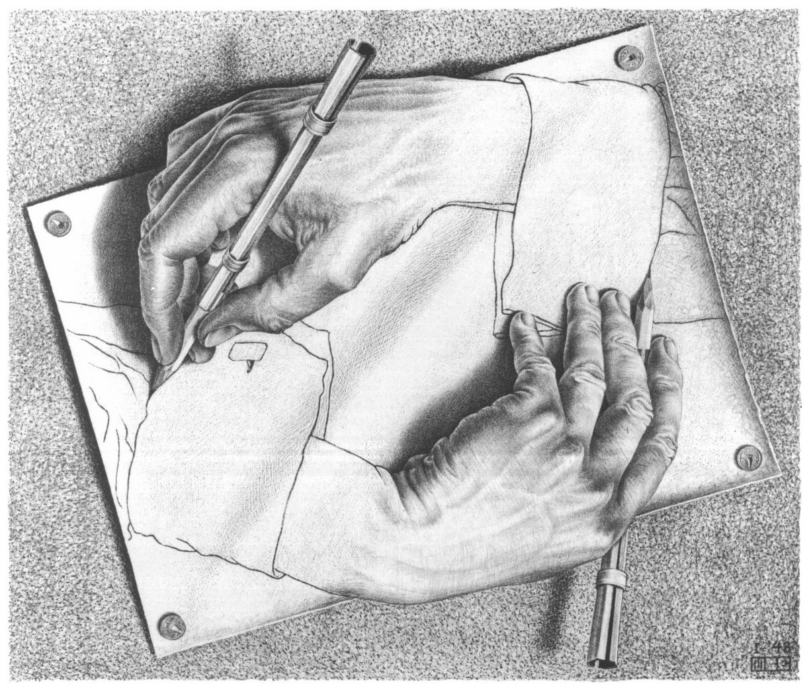

# Jana's Maker Lab Log (2013-14)
## 9 September 2013
### Learning markdown
Can I have a list that is not a list?
* Like what if it's really 
* a sentence (fragment)
* disguised as a 
* list?  
And here comes an image   
And perhaps a link to something useful: [Modernism Lab](http://modernism.research.yale.edu/)  

K. Got the gis . . . idea. So now . . .  

### Searching for BigModData:
\*Should I focus solely on searching for primary texts?\* 

* The[Modernism Lab](http://modernism.research.yale.edu/) at Yale University does not house 
texts but does have info on the activities of 24 leading modernist writers and a wiki of short 
essays on literary works and movements of the period. Some of the material came out of courses
on Modern texts and topics, and is therefore written by undergrads and grad students. The 
project focuses the period 1914-1926 and attempts to "describe the emergence of modernism out of a 
background of social, political, and existential ferment." 
* The YNote feature highlights the connections between authors and other key figures, places, and
various texts. Included are excerpts from correspondence between authors and publishers 
on key modernist texts. There are excerpts in the wiki section from source texts 
[(example from Cathay)](http://modernism.research.yale.edu/wiki/index.php/Cathay).
* In terms of locating modernist texts, the most useful page is probably the 
[Links to Etexts](http://modernism.research.yale.edu/digital_archive.php), which includes external
links to full plain text versions of the listed works.
* While this site is good for canonical modernist texts and authors, it makes no claims to include 
or address alternative modernisms in its scope.

* [Project Gutenberg Canada](http://www.gutenberg.ca/) has texts in the Canadian public domain. 
The benefit is you don't have to worry about access rights within Canada. There doesn't appear to be 
much poetry! Someone has also assembled a list of [Canadiana](http://www.victoria.tc.ca/~sly/cancon.htm) that can be 
found on Project Gutenberg. These are all in the public domain. The links are broken but the texts
do exist if you search for them on Project Gutenberg. There is also a lot more Canadiana on Project Gutenberg
that is not included on this list, so it could be used as a starting point, but should be in no
way regarded as complete. 

* Familiarizing myself with [Canadian copyright](http://www.cipo.ic.gc.ca/eic/site/cipointernet-internetopic.nsf/eng/h_wr02281.html)
	- In the simplest terms, "copyright" means "the right to copy." In general, copyright means the   
	sole right to produce or reproduce a work or a substantial part of it in any form. It includes   
	the right to perform the work or any substantial part of it or, in the case of a lecture, to   
	deliver it. If the work is unpublished, it includes the right to publish the work or any substantial   
	part of it.  
	- Then in Canada it generally lasts until 50 years after the end of the year of the author's death.

*OK. So thinking about a spreadsheet:
Need URL, example holdings, format(s), rights, date of access. 
* Messaged @ghostprof regarding meeting to discuss this project. 
* Met ghostprof in his office and chatted re: Amanda, Matt, modernist repo.
	- He's going to get in touch with Amanda about the additional texts she might have
	- I'm going to email Matt
	
### Met Katie re: publishing TEI paper